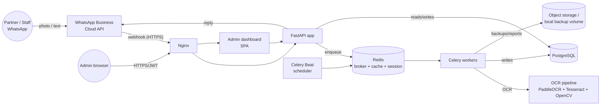
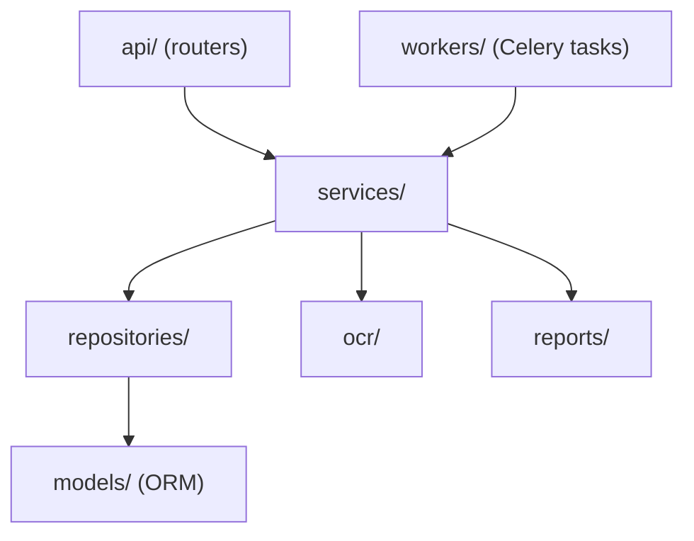
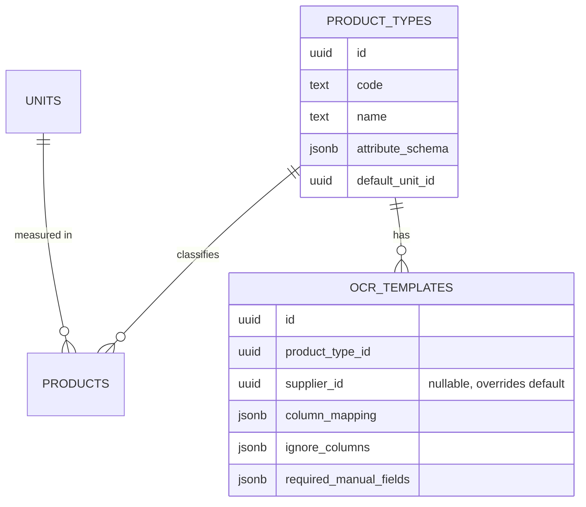

# 01 — Architecture

## 1. System context



## 2. Why this stack

| Choice | Rationale |
|---|---|
| **FastAPI** | Async I/O suits a webhook-driven app where most latency is external (WhatsApp API, OCR). Pydantic gives request/response validation for free, which matters because WhatsApp payloads and OCR output are both untrusted, messy input. |
| **PostgreSQL** | Strong transactional guarantees are required for money and inventory — this is a ledger system, not an analytics system. `NUMERIC` type, row-level locking, and mature JSONB support (for `products.attributes`) all matter directly. |
| **SQLAlchemy 2.0 async + Alembic** | Explicit migrations are non-negotiable for a financial schema — no "auto-sync" ORMs. Async ORM avoids blocking the event loop under FastAPI. |
| **Redis** | Triple role: Celery broker/result backend, cache for dashboard aggregates ([12_Dashboard.md](12_Dashboard.md#caching)), and WhatsApp conversation session state ([08_WhatsApp.md](08_WhatsApp.md#session-state-machine)) — one moving part instead of three. |
| **Celery + Beat** | OCR, report generation, and backups are all slow-or-scheduled work that must not block the webhook response (WhatsApp expects a fast 200 OK). Beat covers nightly/cron-style jobs (backup, low-stock scan, reconciliation). |
| **PaddleOCR + Tesseract + OpenCV** | PaddleOCR handles printed tabular text well and supports angle classification out of the box; Tesseract is the fallback engine when PaddleOCR confidence is low on a cell, since the two engines fail on different things (see [07_OCR.md](07_OCR.md#dual-engine-strategy)). OpenCV owns preprocessing (deskew, denoise, crop, table-line detection) since neither OCR engine does that reliably on phone-camera photos. |
| **Pandas + openpyxl** | Excel export must byte-for-byte match the partners' existing sheet layout (S.NO / QTY / DESCRIPTION / CODE / LABEL / KG / T.KG with totals) — openpyxl gives cell-level formatting control that a generic "export to CSV" does not. |
| **Docker Compose** | Single-server deployment for a two-person business does not need Kubernetes; Compose gives reproducible environments and a one-command deploy (see [16_Deployment.md](16_Deployment.md)). |
| **Nginx** | TLS termination, and the one component required by Meta: WhatsApp webhooks must be HTTPS. |
| **JWT** | Stateless auth for the admin dashboard/API; WhatsApp users are authenticated by verified phone number, not JWT (see [14_Security.md](14_Security.md#whatsapp-sender-verification)). |

## 3. Component responsibilities

- **`backend/api`** — FastAPI routers. Parses HTTP/webhook input into
  Pydantic schemas, calls exactly one service method, returns the
  response. No business logic, no direct DB session use beyond what
  FastAPI's dependency injection provides to the service layer.
- **`backend/services`** — All business logic and orchestration lives
  here. A service method represents one use case (e.g.,
  `PurchaseService.create_from_ocr_result(...)`). Services call
  repositories, never the ORM session directly for querying (they may
  use the session for transaction boundaries).
- **`backend/repositories`** — One repository per aggregate root
  (`ProductRepository`, `PurchaseRepository`, ...). Owns all SQL/ORM
  query construction. No business rules here beyond "how do I fetch/
  persist this shape of data."
- **`backend/models`** — SQLAlchemy ORM models, one module per table
  family, mirroring [02_Database.md](02_Database.md).
- **`backend/schemas`** — Pydantic models for API/webhook request and
  response shapes. Never reused as ORM models.
- **`backend/workers`** — Celery task definitions. Thin: a task fetches
  its inputs, calls a service method, handles retry/failure semantics.
  See [11_BackgroundWorkers.md](11_BackgroundWorkers.md).
- **`backend/ocr`** — The OCR pipeline (preprocess → detect → extract →
  match → learn), independent of Celery/FastAPI so it can be unit
  tested against fixture images directly. See [07_OCR.md](07_OCR.md).
- **`backend/reports`** — Report/export generation (Pandas/openpyxl/
  PDF). See [13_Reports.md](13_Reports.md).
- **`backend/core`** — Cross-cutting: settings (`pydantic-settings`),
  DB session/engine setup, structured logging config, security
  utilities (JWT, password hashing), exception types.

## 4. Layering rule (enforced, not aspirational)



A router never imports a repository directly. A repository never
imports another repository's models to implement business rules (e.g.,
`PurchaseRepository` does not decide inventory logic — it persists
purchase rows; `InventoryService` decides what movements result).
This is enforced in CI via `import-linter` (contract defined in
[17_CodingStandards.md](17_CodingStandards.md#import-boundaries)).

## 5. Config-driven product-type system

The mechanism that keeps the core generic (see
[00_ProjectVision.md §4](00_ProjectVision.md)):



`PurchaseService` and the OCR pipeline resolve behavior by loading the
`ocr_templates` row for `(product_type, supplier)` — falling back to
`(product_type, NULL)` — at runtime. Adding "hardware" as a new traded
category means inserting one `product_types` row and one
`ocr_templates` row; zero code changes. Full schema in
[02_Database.md](02_Database.md#product_types).

## 6. Request flow: WhatsApp text command (synchronous path)

```mermaid
sequenceDiagram
    participant U as Partner (WhatsApp)
    participant WA as WhatsApp Cloud API
    participant API as FastAPI /webhooks/whatsapp
    participant SVC as Service layer
    participant DB as PostgreSQL
    participant R as Redis (session)

    U->>WA: "sale ABC TRP 20 165"
    WA->>API: POST webhook (message payload)
    API->>API: verify signature (X-Hub-Signature-256)
    API->>R: dedupe check on WhatsApp message id
    alt duplicate message id
        API-->>WA: 200 OK (no-op)
    else new message
        API->>R: load/refresh session state for sender
        API->>SVC: SalesCommandHandler.handle(text, sender, session)
        SVC->>DB: validate customer, product, stock, pricing rules
        alt validation fails
            SVC-->>API: error result (typed)
            API->>WA: send error message
        else valid
            SVC->>DB: BEGIN; insert sales_headers/lines; insert inventory_movements; COMMIT
            SVC->>DB: insert audit_logs row
            SVC-->>API: success result
            API->>WA: send confirmation message
        end
        API-->>WA: 200 OK
    end
```

## 7. Request flow: OCR purchase entry (asynchronous path)

```mermaid
sequenceDiagram
    participant U as Partner (WhatsApp)
    participant WA as WhatsApp Cloud API
    participant API as FastAPI
    participant Q as Celery (Redis broker)
    participant W as Celery worker
    participant OCR as OCR pipeline
    participant DB as PostgreSQL
    participant R as Redis (session)

    U->>WA: sends photo of invoice
    WA->>API: POST webhook (media message)
    API->>R: dedupe check
    API->>API: download media from WhatsApp Media API
    API->>DB: create attachments row (status=processing)
    API->>Q: enqueue ocr_process_purchase_sheet(attachment_id)
    API->>WA: "Got it, reading your invoice…" (immediate ack, <5s)
    API-->>WA: 200 OK
    Q->>W: deliver task
    W->>OCR: preprocess -> detect table -> extract cells -> fuzzy match
    OCR-->>W: parsed rows + confidence + missing required fields
    W->>DB: create purchase_headers (status=draft), purchase_lines
    W->>R: set session state = awaiting_confirmation(purchase_id)
    W->>WA: send preview table + "Reply CONFIRM or corrections"
    U->>WA: "CONFIRM" (or "line 3 code should be TRP-22")
    WA->>API: webhook
    API->>R: load session -> awaiting_confirmation
    API->>SVC as PurchaseService: confirm_or_correct(purchase_id, message)
    SVC->>DB: apply corrections; if correction, upsert ocr_learning_dictionary
    alt confirmed
        SVC->>DB: BEGIN; status=confirmed; inventory_movements; weighted avg recompute; COMMIT
        SVC->>DB: audit_logs
        SVC->>WA: final confirmation summary
        SVC->>R: clear session state
    else more corrections
        SVC->>WA: updated preview, session remains awaiting_confirmation
    end
```

## 8. Idempotency and delivery guarantees

- WhatsApp may redeliver the same webhook (network retries on Meta's
  side). Every inbound message is deduped on `whatsapp_message_id` in
  Redis with a 24h TTL before any processing begins (see
  [08_WhatsApp.md](08_WhatsApp.md#message-deduplication)).
- Every Celery task is idempotent by design: `ocr_process_purchase_sheet`
  is safe to run twice for the same `attachment_id` (it checks
  `attachments.status` first and no-ops if already `processed`).
  Financial mutation tasks (e.g., nightly reconciliation) use
  `SELECT ... FOR UPDATE` or unique constraints to make retries safe.
- The webhook handler acknowledges WhatsApp within 5 seconds always —
  anything that could take longer (OCR, report generation) is
  Celery-dispatched immediately and the user gets an async follow-up
  message.

## 9. Configuration & environments

- `pydantic-settings` `Settings` class in `backend/core/config.py`,
  loaded from environment variables (12-factor). No secrets in code or
  in `docker-compose.yml` directly — see
  [16_Deployment.md](16_Deployment.md#secrets).
- Three environments: `local` (docker compose, hot reload），`staging`
  (mirrors prod, used for OCR template tuning against real supplier
  sheets before rollout), `production`.
- Feature flags are **not** used for permanent product-type branching
  (that's what `product_types`/`ocr_templates` config rows are for) —
  only for genuinely temporary rollout gating (e.g., enabling a new
  WhatsApp command for a subset of users during testing), stored in
  `settings` table, read through a thin `FeatureFlags` service.

## 10. Error handling philosophy

- Domain errors (validation failures, duplicate detection, business
  rule violations) are typed exceptions in `backend/core/exceptions.py`
  (`DuplicateInvoiceError`, `NegativeStockError`, `BelowCostSaleError`,
  ...), caught at the API/webhook boundary and translated into
  user-facing WhatsApp messages or API error responses. They are
  **expected outcomes**, not bugs — logged at `INFO`, not `ERROR`.
- Infrastructure errors (DB connection loss, WhatsApp API 5xx, OCR
  engine crash) are logged at `ERROR` with full context via
  `structlog`, trigger Celery retry with exponential backoff (see
  [11_BackgroundWorkers.md](11_BackgroundWorkers.md#retry-policy)), and
  never surface raw stack traces to WhatsApp users — the user gets
  "Something went wrong, we're on it" and the partner (as `owner`) also
  gets a diagnostic alert if the same failure repeats 3+ times in an
  hour (see [14_Security.md](14_Security.md#suspicious-transaction-detection)
  for the general alerting pattern this reuses).

## 11. Performance & scalability considerations

- **Current scale target**: 2 primary users, low tens of transactions/
  day, a product catalog in the low thousands. This is explicitly not a
  high-throughput system — over-engineering for scale it doesn't have
  is avoided (no read replicas, no sharding, no message queue beyond
  Celery/Redis).
- **What is still built in from day one because retrofitting is
  expensive**: async I/O throughout (cheap to do correctly up front,
  expensive to bolt on later), proper indexing on every FK and every
  WhatsApp-command lookup path (see [02_Database.md](02_Database.md#indexes)),
  and the `org_id` column on every table (near-zero cost now, a full
  migration later — see [18_FutureRoadmap.md](18_FutureRoadmap.md)).
- **Dashboard aggregates are cached in Redis** with short TTLs (60s)
  and explicit invalidation on writes that affect them, because
  `dashboard`/`summary` are the most frequently issued WhatsApp
  commands and must stay under the 3-second target from
  [00_ProjectVision.md §8](00_ProjectVision.md).
- **OCR is the heaviest operation** (seconds, not milliseconds) — it is
  always off the request path (Celery), and PaddleOCR runs on CPU by
  default (no GPU dependency, since deployment is a single small
  server); see [07_OCR.md §9](07_OCR.md) for measured latency budgets.
- Horizontal scaling path if the business grows or this becomes
  multi-tenant: Celery workers scale independently by adding worker
  containers (stateless); FastAPI app is stateless and can run multiple
  replicas behind Nginx; PostgreSQL is the one component that would
  need a real scaling plan (read replica for reporting queries) — not
  needed at current scale, documented as a roadmap item, not built now.

## 12. Illustrative pattern (not a stub — this is the actual shape every service/repository follows)

```python
# backend/repositories/purchase_repository.py
class PurchaseRepository:
    def __init__(self, session: AsyncSession) -> None:
        self._session = session

    async def get_by_id(self, org_id: UUID, purchase_id: UUID) -> PurchaseHeader | None:
        stmt = (
            select(PurchaseHeader)
            .where(
                PurchaseHeader.id == purchase_id,
                PurchaseHeader.org_id == org_id,
                PurchaseHeader.deleted_at.is_(None),
            )
            .options(selectinload(PurchaseHeader.lines))
        )
        return (await self._session.execute(stmt)).scalar_one_or_none()

    async def find_potential_duplicates(
        self, org_id: UUID, supplier_id: UUID, invoice_no: str, invoice_date: date, total: Decimal
    ) -> list[PurchaseHeader]:
        # Exact + fuzzy candidates; fuzzy matching itself happens in the
        # service layer against this candidate set (see 04_Purchases.md).
        stmt = select(PurchaseHeader).where(
            PurchaseHeader.org_id == org_id,
            PurchaseHeader.supplier_id == supplier_id,
            PurchaseHeader.deleted_at.is_(None),
            PurchaseHeader.invoice_date.between(invoice_date - timedelta(days=3), invoice_date + timedelta(days=3)),
        )
        return list((await self._session.execute(stmt)).scalars())


# backend/services/purchase_service.py
class PurchaseService:
    def __init__(self, repo: PurchaseRepository, inventory: InventoryService, audit: AuditService) -> None:
        self._repo = repo
        self._inventory = inventory
        self._audit = audit

    async def confirm_purchase(self, org_id: UUID, purchase_id: UUID, actor_id: UUID) -> PurchaseHeader:
        purchase = await self._repo.get_by_id(org_id, purchase_id)
        if purchase is None:
            raise PurchaseNotFoundError(purchase_id)
        if purchase.status != PurchaseStatus.DRAFT:
            raise InvalidPurchaseStateError(purchase.status)

        duplicates = await self._repo.find_potential_duplicates(
            org_id, purchase.supplier_id, purchase.invoice_no, purchase.invoice_date, purchase.grand_total
        )
        duplicates = [d for d in duplicates if d.id != purchase.id and is_fuzzy_duplicate(purchase, d)]
        if duplicates:
            raise DuplicateInvoiceError(purchase, duplicates)

        async with self._repo.transaction():
            purchase.status = PurchaseStatus.CONFIRMED
            for line in purchase.lines:
                await self._inventory.record_purchase_movement(org_id, line, actor_id)
            await self._audit.record(org_id, actor_id, "purchase.confirmed", purchase.id)

        return purchase
```

This is the pattern every feature in this system follows: typed domain
exceptions for expected business outcomes, an explicit transaction
boundary around the DB write, and an audit record for every mutation.
