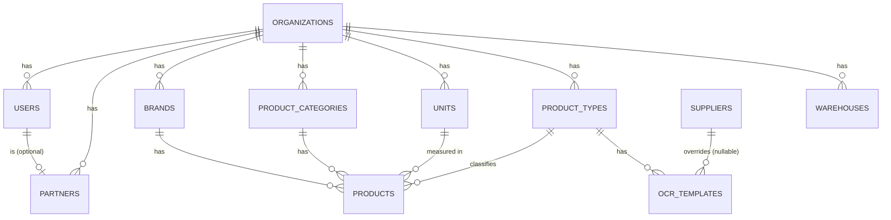
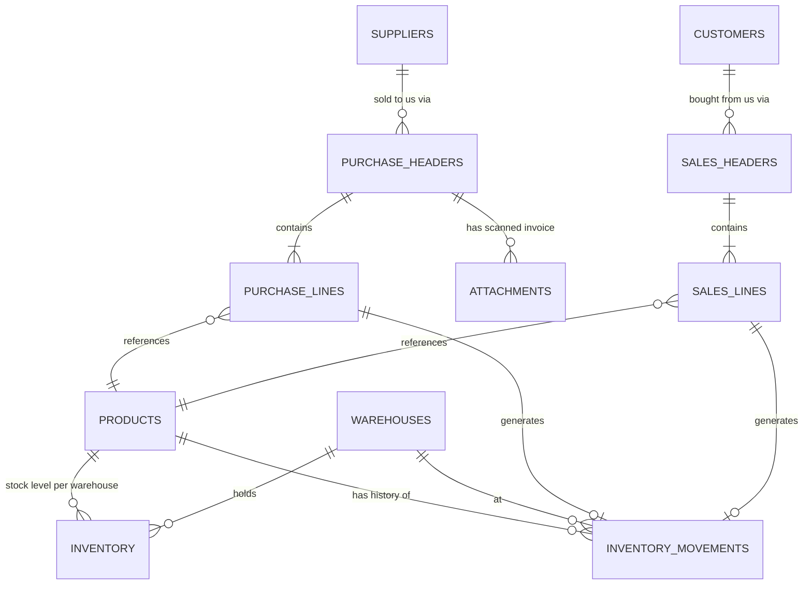
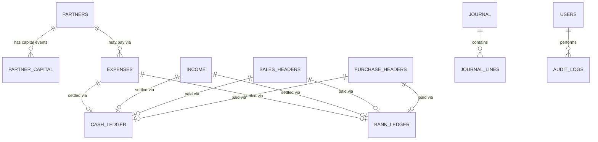

# 02 — Database

PostgreSQL 16. All monetary and quantity columns use `NUMERIC`, never
`FLOAT`/`DOUBLE PRECISION` — floating point rounding error in an
accounting system is a correctness bug, not a cosmetic one. All
timestamps are `TIMESTAMPTZ`, stored in UTC; display-layer conversion to
the business's local timezone (`settings.timezone`, e.g.
`Asia/Kolkata`) happens in the presentation layer (WhatsApp formatter,
dashboard API), never in the database or in stored values.

## 1. Conventions

- Primary key: `id UUID PRIMARY KEY DEFAULT gen_random_uuid()` (via the
  `pgcrypto` extension) on every table.
- Every **business** table (not pure config/lookup tables) has:
  `org_id UUID NOT NULL REFERENCES organizations(id)`,
  `created_at TIMESTAMPTZ NOT NULL DEFAULT now()`,
  `updated_at TIMESTAMPTZ NOT NULL DEFAULT now()` (bumped by an
  `updated_at` trigger, not application code, so it's correct even for
  raw SQL fixes),
  `created_by UUID NOT NULL REFERENCES users(id)`,
  `deleted_at TIMESTAMPTZ` (nullable — soft delete, see §4).
- Table names: `snake_case`, plural.
- Money columns: `NUMERIC(14,2)`. Quantity/weight columns:
  `NUMERIC(12,3)` (supports fractional KG to 3 decimal places, which
  the reference sheets use). Rate/price columns: `NUMERIC(12,4)`
  (extra precision so weighted-average rounding doesn't lose cents
  across thousands of units).
- Foreign keys are always indexed explicitly (Postgres does not
  auto-index FK columns) — see §7.
- Every table gets a `pgcrypto`-backed UUID default; every business
  table's `org_id` is part of every unique constraint that should be
  scoped per business (e.g., invoice-number uniqueness is per-org, not
  global).

## 2. Entity-relationship diagrams

### 2.1 Core / configuration domain



### 2.2 Transactional domain



### 2.3 Accounting domain



## 3. Schema DDL

### 3.1 `organizations`

Single seeded row today; exists so multi-tenancy is additive later
(see [18_FutureRoadmap.md](18_FutureRoadmap.md#multi-tenancy)).

```sql
CREATE EXTENSION IF NOT EXISTS pgcrypto;
CREATE EXTENSION IF NOT EXISTS pg_trgm; -- fuzzy text search / duplicate detection

CREATE TABLE organizations (
    id UUID PRIMARY KEY DEFAULT gen_random_uuid(),
    name TEXT NOT NULL,
    base_currency CHAR(3) NOT NULL DEFAULT 'INR',
    timezone TEXT NOT NULL DEFAULT 'Asia/Kolkata',
    created_at TIMESTAMPTZ NOT NULL DEFAULT now(),
    updated_at TIMESTAMPTZ NOT NULL DEFAULT now()
);
```

### 3.2 `users`

```sql
CREATE TYPE user_role AS ENUM ('owner', 'staff', 'viewer');

CREATE TABLE users (
    id UUID PRIMARY KEY DEFAULT gen_random_uuid(),
    org_id UUID NOT NULL REFERENCES organizations(id),
    full_name TEXT NOT NULL,
    whatsapp_number TEXT UNIQUE, -- E.164 format, e.g. +919876543210; NULL for viewer-only accounts
    email CITEXT UNIQUE,          -- required for dashboard login (owner/viewer)
    password_hash TEXT,           -- NULL for WhatsApp-only staff with no dashboard access
    role user_role NOT NULL DEFAULT 'staff',
    is_active BOOLEAN NOT NULL DEFAULT TRUE,
    created_at TIMESTAMPTZ NOT NULL DEFAULT now(),
    updated_at TIMESTAMPTZ NOT NULL DEFAULT now(),
    deleted_at TIMESTAMPTZ,
    CONSTRAINT users_login_method_chk CHECK (whatsapp_number IS NOT NULL OR email IS NOT NULL)
);
CREATE EXTENSION IF NOT EXISTS citext;
```

`whatsapp_number` is how WhatsApp senders are resolved to a `user` on
every inbound message — see
[08_WhatsApp.md](08_WhatsApp.md#sender-resolution). An inbound message
from an unrecognized number is rejected before touching any business
logic.

### 3.3 `partners`

Distinct from `users` because a partner is an accounting entity (has
capital, draws, profit share) even if they never touch WhatsApp
directly (e.g., a silent investor partner). Most partners are also
`users`.

```sql
CREATE TABLE partners (
    id UUID PRIMARY KEY DEFAULT gen_random_uuid(),
    org_id UUID NOT NULL REFERENCES organizations(id),
    user_id UUID REFERENCES users(id), -- nullable
    display_name TEXT NOT NULL,
    profit_share_percent NUMERIC(5,2) NOT NULL CHECK (profit_share_percent >= 0 AND profit_share_percent <= 100),
    created_at TIMESTAMPTZ NOT NULL DEFAULT now(),
    updated_at TIMESTAMPTZ NOT NULL DEFAULT now(),
    created_by UUID NOT NULL REFERENCES users(id),
    deleted_at TIMESTAMPTZ
);
-- Application-level invariant (checked in PartnerService, not a DB constraint,
-- since it must sum across a whole org's active partners):
-- SUM(profit_share_percent) WHERE deleted_at IS NULL = 100 per org_id.
```

### 3.4 `units`

```sql
CREATE TYPE unit_kind AS ENUM ('weight', 'count', 'length', 'volume');

CREATE TABLE units (
    id UUID PRIMARY KEY DEFAULT gen_random_uuid(),
    org_id UUID NOT NULL REFERENCES organizations(id),
    code TEXT NOT NULL,           -- 'KG', 'PCS', 'MTR', 'ROLL', 'BOX'
    name TEXT NOT NULL,
    kind unit_kind NOT NULL,
    created_at TIMESTAMPTZ NOT NULL DEFAULT now(),
    UNIQUE (org_id, code)
);
```

Seeded defaults on org creation: `KG` (weight), `PCS` (count), `MTR`
(length), `ROLL` (count), `BOX` (count). The textile product type uses
`KG` as its costing unit; a future non-weight product type (e.g.
"hardware," sold by `PCS`) uses the same `units` table with no schema
change.

### 3.5 `product_categories` and `brands`

```sql
CREATE TABLE product_categories (
    id UUID PRIMARY KEY DEFAULT gen_random_uuid(),
    org_id UUID NOT NULL REFERENCES organizations(id),
    name TEXT NOT NULL,
    parent_id UUID REFERENCES product_categories(id), -- nullable, supports simple hierarchy
    created_at TIMESTAMPTZ NOT NULL DEFAULT now(),
    UNIQUE (org_id, name, parent_id)
);

CREATE TABLE brands (
    id UUID PRIMARY KEY DEFAULT gen_random_uuid(),
    org_id UUID NOT NULL REFERENCES organizations(id),
    name TEXT NOT NULL,
    created_at TIMESTAMPTZ NOT NULL DEFAULT now(),
    deleted_at TIMESTAMPTZ,
    UNIQUE (org_id, name)
);
```

### 3.6 `product_types` {#product_types}

The mechanism that keeps the core generic — see
[01_Architecture.md §5](01_Architecture.md#5-config-driven-product-type-system).

```sql
CREATE TABLE product_types (
    id UUID PRIMARY KEY DEFAULT gen_random_uuid(),
    org_id UUID NOT NULL REFERENCES organizations(id),
    code TEXT NOT NULL,               -- 'textile', 'hardware', 'grocery', ...
    name TEXT NOT NULL,
    default_unit_id UUID NOT NULL REFERENCES units(id),
    costing_strategy TEXT NOT NULL DEFAULT 'weighted_average'
        CHECK (costing_strategy IN ('weighted_average')), -- extensibility point; only one implemented in v1
    attribute_schema JSONB NOT NULL DEFAULT '{}'::jsonb, -- JSON Schema describing products.attributes for this type
    created_at TIMESTAMPTZ NOT NULL DEFAULT now(),
    UNIQUE (org_id, code)
);
```

Seed row for textile:

```json
{
  "code": "textile",
  "name": "Textile / Fabric",
  "attribute_schema": {
    "type": "object",
    "properties": {
      "gsm": { "type": "number", "description": "grams per square metre" },
      "width_cm": { "type": "number" },
      "color": { "type": "string" }
    },
    "additionalProperties": false
  }
}
```

`attribute_schema` is validated against `products.attributes` at write
time in `ProductService.create`/`update` using `jsonschema` — an
invalid attribute payload is a `400` (API) or a WhatsApp validation
error, never silently stored.

### 3.7 `products`

```sql
CREATE TABLE products (
    id UUID PRIMARY KEY DEFAULT gen_random_uuid(),
    org_id UUID NOT NULL REFERENCES organizations(id),
    product_type_id UUID NOT NULL REFERENCES product_types(id),
    code TEXT NOT NULL,               -- e.g. 'TRP', 'MJP' from the reference sheets
    description TEXT NOT NULL,
    brand_id UUID REFERENCES brands(id),
    category_id UUID REFERENCES product_categories(id),
    unit_id UUID NOT NULL REFERENCES units(id),
    attributes JSONB NOT NULL DEFAULT '{}'::jsonb,
    reorder_level NUMERIC(12,3),      -- NULL = no low-stock alert configured
    is_active BOOLEAN NOT NULL DEFAULT TRUE,
    created_at TIMESTAMPTZ NOT NULL DEFAULT now(),
    updated_at TIMESTAMPTZ NOT NULL DEFAULT now(),
    created_by UUID NOT NULL REFERENCES users(id),
    deleted_at TIMESTAMPTZ,
    UNIQUE (org_id, code)
);
```

`code` is the short code from the purchase sheet (`TRP`, `MJP`, ...);
uniqueness is per-org, case-insensitive in practice (enforced via a
`UNIQUE (org_id, upper(code))` expression index rather than lowering
the constraint — see §7).

### 3.8 `ocr_templates` {#ocr-templates}

```sql
CREATE TABLE ocr_templates (
    id UUID PRIMARY KEY DEFAULT gen_random_uuid(),
    org_id UUID NOT NULL REFERENCES organizations(id),
    product_type_id UUID NOT NULL REFERENCES product_types(id),
    supplier_id UUID REFERENCES suppliers(id), -- NULL = default template for this product type
    name TEXT NOT NULL,
    column_mapping JSONB NOT NULL,     -- ordered list of {header_aliases: [...], field: "qty"|"description"|"code"|"weight_kg"|"total_weight_kg"}
    ignore_columns JSONB NOT NULL DEFAULT '["s.no","label","total"]'::jsonb,
    required_manual_fields JSONB NOT NULL DEFAULT
        '["supplier","brand","invoice_no","invoice_date","purchase_rate","freight","other_charges"]'::jsonb,
    is_active BOOLEAN NOT NULL DEFAULT TRUE,
    created_at TIMESTAMPTZ NOT NULL DEFAULT now(),
    updated_at TIMESTAMPTZ NOT NULL DEFAULT now(),
    UNIQUE (org_id, product_type_id, supplier_id)
);
```

### 3.9 `ocr_learning_dictionary` {#ocr-learning-dictionary}

```sql
CREATE TABLE ocr_learning_dictionary (
    id UUID PRIMARY KEY DEFAULT gen_random_uuid(),
    org_id UUID NOT NULL REFERENCES organizations(id),
    supplier_id UUID REFERENCES suppliers(id), -- NULL = applies to any supplier
    field TEXT NOT NULL,               -- 'code' | 'description'
    raw_ocr_text TEXT NOT NULL,        -- exactly what the OCR engine produced
    corrected_value TEXT NOT NULL,     -- what the user confirmed it should be
    hit_count INTEGER NOT NULL DEFAULT 1, -- incremented each time this correction is reused successfully
    created_at TIMESTAMPTZ NOT NULL DEFAULT now(),
    updated_at TIMESTAMPTZ NOT NULL DEFAULT now(),
    UNIQUE (org_id, supplier_id, field, raw_ocr_text)
);
```

Full behavior in [07_OCR.md §8](07_OCR.md#learning-dictionary).

### 3.10 `suppliers` and `customers`

```sql
CREATE TABLE suppliers (
    id UUID PRIMARY KEY DEFAULT gen_random_uuid(),
    org_id UUID NOT NULL REFERENCES organizations(id),
    name TEXT NOT NULL,
    phone TEXT,
    address TEXT,
    gst_number TEXT,
    opening_balance NUMERIC(14,2) NOT NULL DEFAULT 0, -- payable owed to supplier at go-live
    created_at TIMESTAMPTZ NOT NULL DEFAULT now(),
    updated_at TIMESTAMPTZ NOT NULL DEFAULT now(),
    created_by UUID NOT NULL REFERENCES users(id),
    deleted_at TIMESTAMPTZ,
    UNIQUE (org_id, name)
);

CREATE TABLE customers (
    id UUID PRIMARY KEY DEFAULT gen_random_uuid(),
    org_id UUID NOT NULL REFERENCES organizations(id),
    name TEXT NOT NULL,
    phone TEXT,
    address TEXT,
    gst_number TEXT,
    credit_limit NUMERIC(14,2),        -- NULL = no limit enforced
    opening_balance NUMERIC(14,2) NOT NULL DEFAULT 0, -- receivable owed by customer at go-live
    created_at TIMESTAMPTZ NOT NULL DEFAULT now(),
    updated_at TIMESTAMPTZ NOT NULL DEFAULT now(),
    created_by UUID NOT NULL REFERENCES users(id),
    deleted_at TIMESTAMPTZ,
    UNIQUE (org_id, name)
);
```

### 3.11 `warehouses`

```sql
CREATE TABLE warehouses (
    id UUID PRIMARY KEY DEFAULT gen_random_uuid(),
    org_id UUID NOT NULL REFERENCES organizations(id),
    name TEXT NOT NULL,
    is_default BOOLEAN NOT NULL DEFAULT FALSE,
    created_at TIMESTAMPTZ NOT NULL DEFAULT now(),
    UNIQUE (org_id, name)
);
-- exactly one warehouse per org may have is_default = TRUE, enforced by a partial unique index:
CREATE UNIQUE INDEX warehouses_one_default_per_org ON warehouses (org_id) WHERE is_default;
```

One `warehouses` row (`"Main"`) is seeded per org; every command that
doesn't mention a warehouse resolves to the default.

### 3.12 `purchase_headers` and `purchase_lines`

```sql
CREATE TYPE purchase_status AS ENUM ('draft', 'confirmed', 'cancelled');

CREATE TABLE purchase_headers (
    id UUID PRIMARY KEY DEFAULT gen_random_uuid(),
    org_id UUID NOT NULL REFERENCES organizations(id),
    supplier_id UUID NOT NULL REFERENCES suppliers(id),
    brand_id UUID REFERENCES brands(id),
    warehouse_id UUID NOT NULL REFERENCES warehouses(id),
    invoice_no TEXT NOT NULL,
    invoice_date DATE NOT NULL,
    purchase_rate NUMERIC(12,4),        -- per-unit rate if uniform across the invoice; NULL if per-line
    freight NUMERIC(14,2) NOT NULL DEFAULT 0,
    other_charges NUMERIC(14,2) NOT NULL DEFAULT 0,
    freight_allocation_method TEXT NOT NULL DEFAULT 'by_weight'
        CHECK (freight_allocation_method IN ('by_weight','by_value','by_qty','manual')),
    subtotal NUMERIC(14,2) NOT NULL DEFAULT 0,   -- sum of line (qty * rate), before freight/other_charges
    grand_total NUMERIC(14,2) NOT NULL DEFAULT 0, -- subtotal + freight + other_charges
    declared_total NUMERIC(14,2),        -- the total printed on the supplier invoice, for mismatch checking
    status purchase_status NOT NULL DEFAULT 'draft',
    payment_status TEXT NOT NULL DEFAULT 'unpaid' CHECK (payment_status IN ('unpaid','partial','paid')),
    amount_paid NUMERIC(14,2) NOT NULL DEFAULT 0,
    ocr_source_attachment_id UUID REFERENCES attachments(id),
    notes TEXT,
    created_at TIMESTAMPTZ NOT NULL DEFAULT now(),
    updated_at TIMESTAMPTZ NOT NULL DEFAULT now(),
    created_by UUID NOT NULL REFERENCES users(id),
    deleted_at TIMESTAMPTZ,
    UNIQUE (org_id, supplier_id, invoice_no) -- exact-duplicate guard; fuzzy guard is application-level, see 04_Purchases.md
);

CREATE TABLE purchase_lines (
    id UUID PRIMARY KEY DEFAULT gen_random_uuid(),
    org_id UUID NOT NULL REFERENCES organizations(id),
    purchase_header_id UUID NOT NULL REFERENCES purchase_headers(id),
    line_no INTEGER NOT NULL,
    product_id UUID NOT NULL REFERENCES products(id),
    qty NUMERIC(12,3) NOT NULL CHECK (qty > 0),
    weight_kg NUMERIC(12,3),             -- per-unit weight, nullable for non-weight product types
    total_weight_kg NUMERIC(12,3),       -- qty * weight_kg, stored (not generated) so OCR mismatches are visible pre-save
    rate NUMERIC(12,4) NOT NULL CHECK (rate >= 0),
    line_total NUMERIC(14,2) NOT NULL,   -- qty * rate (or total_weight_kg * rate for weight-costed types)
    freight_allocated NUMERIC(14,2) NOT NULL DEFAULT 0,
    landed_cost_per_unit NUMERIC(12,4),  -- (line_total + freight_allocated + other_allocated) / qty, computed on confirm
    ocr_confidence NUMERIC(4,3),         -- 0.000–1.000, NULL if manually entered
    created_at TIMESTAMPTZ NOT NULL DEFAULT now(),
    UNIQUE (purchase_header_id, line_no)
);
```

### 3.13 `sales_headers` and `sales_lines`

```sql
CREATE TYPE sale_payment_type AS ENUM ('cash', 'bank', 'credit');

CREATE TABLE sales_headers (
    id UUID PRIMARY KEY DEFAULT gen_random_uuid(),
    org_id UUID NOT NULL REFERENCES organizations(id),
    customer_id UUID NOT NULL REFERENCES customers(id),
    warehouse_id UUID NOT NULL REFERENCES warehouses(id),
    sale_date DATE NOT NULL DEFAULT CURRENT_DATE,
    payment_type sale_payment_type NOT NULL,
    subtotal NUMERIC(14,2) NOT NULL DEFAULT 0,
    grand_total NUMERIC(14,2) NOT NULL DEFAULT 0,
    amount_paid NUMERIC(14,2) NOT NULL DEFAULT 0,
    payment_status TEXT NOT NULL DEFAULT 'unpaid' CHECK (payment_status IN ('unpaid','partial','paid')),
    status TEXT NOT NULL DEFAULT 'confirmed' CHECK (status IN ('confirmed','cancelled','returned','partially_returned')),
    idempotency_key TEXT,                -- see 05_Sales.md#duplicate-sale-detection
    notes TEXT,
    created_at TIMESTAMPTZ NOT NULL DEFAULT now(),
    updated_at TIMESTAMPTZ NOT NULL DEFAULT now(),
    created_by UUID NOT NULL REFERENCES users(id),
    deleted_at TIMESTAMPTZ,
    UNIQUE (org_id, idempotency_key)
);

CREATE TABLE sales_lines (
    id UUID PRIMARY KEY DEFAULT gen_random_uuid(),
    org_id UUID NOT NULL REFERENCES organizations(id),
    sales_header_id UUID NOT NULL REFERENCES sales_headers(id),
    line_no INTEGER NOT NULL,
    product_id UUID NOT NULL REFERENCES products(id),
    qty NUMERIC(12,3) NOT NULL CHECK (qty > 0),
    rate NUMERIC(12,4) NOT NULL CHECK (rate >= 0),
    line_total NUMERIC(14,2) NOT NULL,
    avg_cost_at_sale_time NUMERIC(12,4) NOT NULL, -- snapshot of weighted avg cost at moment of sale, for margin reporting
    returned_qty NUMERIC(12,3) NOT NULL DEFAULT 0,
    created_at TIMESTAMPTZ NOT NULL DEFAULT now(),
    UNIQUE (sales_header_id, line_no)
);
```

### 3.14 `inventory` and `inventory_movements` {#inventory-tables}

```sql
CREATE TABLE inventory (
    id UUID PRIMARY KEY DEFAULT gen_random_uuid(),
    org_id UUID NOT NULL REFERENCES organizations(id),
    product_id UUID NOT NULL REFERENCES products(id),
    warehouse_id UUID NOT NULL REFERENCES warehouses(id),
    qty_on_hand NUMERIC(12,3) NOT NULL DEFAULT 0,
    weighted_avg_cost NUMERIC(12,4) NOT NULL DEFAULT 0,
    updated_at TIMESTAMPTZ NOT NULL DEFAULT now(),
    UNIQUE (org_id, product_id, warehouse_id)
);
-- inventory is a materialized, cached balance. It is never the source of
-- truth on its own -- inventory_movements is. See 03_Inventory.md#reconciliation.

CREATE TYPE movement_type AS ENUM (
    'purchase', 'purchase_return', 'sale', 'sale_return',
    'adjustment_increase', 'adjustment_decrease', 'damage', 'transfer_in', 'transfer_out'
);

CREATE TABLE inventory_movements (
    id UUID PRIMARY KEY DEFAULT gen_random_uuid(),
    org_id UUID NOT NULL REFERENCES organizations(id),
    product_id UUID NOT NULL REFERENCES products(id),
    warehouse_id UUID NOT NULL REFERENCES warehouses(id),
    movement_type movement_type NOT NULL,
    qty_delta NUMERIC(12,3) NOT NULL,   -- signed: +in, -out
    unit_cost NUMERIC(12,4) NOT NULL,   -- cost basis used for this movement (purchase rate, or avg cost at time of sale/damage)
    resulting_qty_on_hand NUMERIC(12,3) NOT NULL, -- running balance snapshot, for audit/debugging without replay
    resulting_avg_cost NUMERIC(12,4) NOT NULL,
    source_type TEXT NOT NULL,          -- 'purchase_line' | 'sales_line' | 'manual_adjustment' | ...
    source_id UUID NOT NULL,            -- FK target depends on source_type (polymorphic; see note below)
    reason TEXT,                        -- required for adjustment_increase/decrease and damage
    created_at TIMESTAMPTZ NOT NULL DEFAULT now(),
    created_by UUID NOT NULL REFERENCES users(id)
    -- append-only: no updated_at, no deleted_at, no UPDATE or DELETE grants
    -- at the application DB role level. Corrections are new offsetting rows.
);
```

`inventory_movements` is append-only by design (see
[03_Inventory.md](03_Inventory.md)) — this is the actual source of
truth; `inventory.qty_on_hand` is a cache recomputed and verified
nightly (see
[11_BackgroundWorkers.md#reconciliation](11_BackgroundWorkers.md#reconciliation)).
`source_id` is intentionally not a DB-level FK (it points at different
tables depending on `source_type`) — referential integrity for it is
enforced in the repository layer, not the schema, which is the one
deliberate exception to "every relationship is an FK" in this schema
and is called out explicitly for that reason.

### 3.15 `expenses`, `income`, `cash_ledger`, `bank_ledger`

```sql
CREATE TABLE expenses (
    id UUID PRIMARY KEY DEFAULT gen_random_uuid(),
    org_id UUID NOT NULL REFERENCES organizations(id),
    category TEXT NOT NULL,             -- e.g. 'rent', 'transport', 'labour', 'utilities'
    amount NUMERIC(14,2) NOT NULL CHECK (amount > 0),
    paid_via TEXT NOT NULL CHECK (paid_via IN ('cash','bank')),
    paid_by_partner_id UUID REFERENCES partners(id), -- for personal-expense-via-capital tracking
    expense_date DATE NOT NULL DEFAULT CURRENT_DATE,
    description TEXT,
    attachment_id UUID REFERENCES attachments(id), -- optional receipt photo
    created_at TIMESTAMPTZ NOT NULL DEFAULT now(),
    updated_at TIMESTAMPTZ NOT NULL DEFAULT now(),
    created_by UUID NOT NULL REFERENCES users(id),
    deleted_at TIMESTAMPTZ
);

CREATE TABLE income (
    id UUID PRIMARY KEY DEFAULT gen_random_uuid(),
    org_id UUID NOT NULL REFERENCES organizations(id),
    category TEXT NOT NULL,             -- e.g. 'interest', 'commission', 'misc'
    amount NUMERIC(14,2) NOT NULL CHECK (amount > 0),
    received_via TEXT NOT NULL CHECK (received_via IN ('cash','bank')),
    income_date DATE NOT NULL DEFAULT CURRENT_DATE,
    description TEXT,
    created_at TIMESTAMPTZ NOT NULL DEFAULT now(),
    updated_at TIMESTAMPTZ NOT NULL DEFAULT now(),
    created_by UUID NOT NULL REFERENCES users(id),
    deleted_at TIMESTAMPTZ
);

CREATE TYPE ledger_entry_type AS ENUM (
    'purchase_payment', 'sale_receipt', 'expense', 'income',
    'capital_in', 'capital_out', 'transfer_to_bank', 'transfer_to_cash', 'opening_balance'
);

CREATE TABLE cash_ledger (
    id UUID PRIMARY KEY DEFAULT gen_random_uuid(),
    org_id UUID NOT NULL REFERENCES organizations(id),
    entry_type ledger_entry_type NOT NULL,
    amount NUMERIC(14,2) NOT NULL,      -- signed: + inflow, - outflow
    resulting_balance NUMERIC(14,2) NOT NULL, -- running balance snapshot
    source_type TEXT NOT NULL,
    source_id UUID,
    entry_date DATE NOT NULL DEFAULT CURRENT_DATE,
    notes TEXT,
    created_at TIMESTAMPTZ NOT NULL DEFAULT now(),
    created_by UUID NOT NULL REFERENCES users(id)
    -- append-only, same rationale as inventory_movements
);

CREATE TABLE bank_ledger (
    id UUID PRIMARY KEY DEFAULT gen_random_uuid(),
    org_id UUID NOT NULL REFERENCES organizations(id),
    entry_type ledger_entry_type NOT NULL,
    amount NUMERIC(14,2) NOT NULL,
    resulting_balance NUMERIC(14,2) NOT NULL,
    source_type TEXT NOT NULL,
    source_id UUID,
    entry_date DATE NOT NULL DEFAULT CURRENT_DATE,
    notes TEXT,
    created_at TIMESTAMPTZ NOT NULL DEFAULT now(),
    created_by UUID NOT NULL REFERENCES users(id)
);
```

### 3.16 `partner_capital`

```sql
CREATE TYPE capital_entry_type AS ENUM ('contribution', 'withdrawal', 'profit_allocation');

CREATE TABLE partner_capital (
    id UUID PRIMARY KEY DEFAULT gen_random_uuid(),
    org_id UUID NOT NULL REFERENCES organizations(id),
    partner_id UUID NOT NULL REFERENCES partners(id),
    entry_type capital_entry_type NOT NULL,
    amount NUMERIC(14,2) NOT NULL,      -- signed: + increases partner equity, - decreases
    resulting_balance NUMERIC(14,2) NOT NULL,
    settled_via TEXT CHECK (settled_via IN ('cash','bank', NULL)),
    entry_date DATE NOT NULL DEFAULT CURRENT_DATE,
    notes TEXT,
    approved_by_partner_ids UUID[] NOT NULL DEFAULT '{}', -- see 06_Accounting.md#dual-approval-withdrawals
    created_at TIMESTAMPTZ NOT NULL DEFAULT now(),
    created_by UUID NOT NULL REFERENCES users(id)
);
```

### 3.17 `journal` (double-entry backbone)

Simplified single-entry ledgers (`cash_ledger`, `bank_ledger`,
`partner_capital`) are what the WhatsApp commands and dashboard read
day-to-day, because that matches how the partners think ("cash went
down by ₹5,000"). `journal`/`journal_lines` is the double-entry
backbone underneath, generated automatically from every transaction,
that makes the Balance Sheet in [06_Accounting.md](06_Accounting.md)
provably balance. See [06_Accounting.md §2](06_Accounting.md) for why
both representations coexist.

```sql
CREATE TABLE journal (
    id UUID PRIMARY KEY DEFAULT gen_random_uuid(),
    org_id UUID NOT NULL REFERENCES organizations(id),
    entry_date DATE NOT NULL,
    description TEXT NOT NULL,
    source_type TEXT NOT NULL,
    source_id UUID NOT NULL,
    created_at TIMESTAMPTZ NOT NULL DEFAULT now(),
    created_by UUID NOT NULL REFERENCES users(id)
);

CREATE TABLE journal_lines (
    id UUID PRIMARY KEY DEFAULT gen_random_uuid(),
    journal_id UUID NOT NULL REFERENCES journal(id),
    account_code TEXT NOT NULL,   -- 'cash','bank','inventory','accounts_receivable','accounts_payable','partner_capital','sales_revenue','cogs','expenses','freight_expense', ...
    debit NUMERIC(14,2) NOT NULL DEFAULT 0 CHECK (debit >= 0),
    credit NUMERIC(14,2) NOT NULL DEFAULT 0 CHECK (credit >= 0),
    CHECK ((debit = 0) <> (credit = 0)) -- exactly one of debit/credit is nonzero per line
);
-- Application-level invariant enforced in JournalService, verified nightly:
-- for every journal_id, SUM(debit) = SUM(credit).
```

### 3.18 `audit_logs` {#audit-logs}

```sql
CREATE TABLE audit_logs (
    id UUID PRIMARY KEY DEFAULT gen_random_uuid(),
    org_id UUID NOT NULL REFERENCES organizations(id),
    actor_user_id UUID NOT NULL REFERENCES users(id),
    action TEXT NOT NULL,           -- 'purchase.confirmed', 'sale.created', 'sale.deleted', 'product.edited', ...
    entity_type TEXT NOT NULL,      -- table name
    entity_id UUID NOT NULL,
    before_state JSONB,             -- NULL for creates
    after_state JSONB,              -- NULL for deletes
    channel TEXT NOT NULL CHECK (channel IN ('whatsapp','api','dashboard','system')),
    ip_address INET,                -- NULL for whatsapp/system channel
    whatsapp_message_id TEXT,       -- NULL for api/dashboard/system channel
    created_at TIMESTAMPTZ NOT NULL DEFAULT now()
    -- append-only. No UPDATE or DELETE grants at all, including to the app's own DB role,
    -- beyond INSERT and SELECT. Enforced via a dedicated Postgres role -- see 14_Security.md.
);
```

Every service method that mutates a business table writes exactly one
`audit_logs` row in the same transaction (see the pattern in
[01_Architecture.md §12](01_Architecture.md#12-illustrative-pattern-not-a-stub-this-is-the-actual-shape-every-servicerepository-follows)).
This is enforced by a repository-layer test in
[15_Testing.md](15_Testing.md#audit-coverage-test) that fails CI if any
mutating service method exists without a corresponding audit call.

### 3.19 `attachments`

```sql
CREATE TABLE attachments (
    id UUID PRIMARY KEY DEFAULT gen_random_uuid(),
    org_id UUID NOT NULL REFERENCES organizations(id),
    file_path TEXT NOT NULL,        -- object storage key or local volume path
    mime_type TEXT NOT NULL,
    file_size_bytes INTEGER NOT NULL,
    sha256_hash TEXT NOT NULL,      -- used for exact-duplicate photo detection, see 04_Purchases.md
    status TEXT NOT NULL DEFAULT 'uploaded' CHECK (status IN ('uploaded','processing','processed','failed')),
    ocr_result JSONB,               -- raw parsed OCR output, kept for debugging/reprocessing
    whatsapp_media_id TEXT,
    created_at TIMESTAMPTZ NOT NULL DEFAULT now(),
    created_by UUID NOT NULL REFERENCES users(id)
);
```

### 3.20 `whatsapp_sessions`

```sql
CREATE TABLE whatsapp_sessions (
    id UUID PRIMARY KEY DEFAULT gen_random_uuid(),
    org_id UUID NOT NULL REFERENCES organizations(id),
    user_id UUID NOT NULL REFERENCES users(id),
    state TEXT NOT NULL,             -- 'idle' | 'awaiting_purchase_confirmation' | 'awaiting_sale_confirmation' | ...
    context JSONB NOT NULL DEFAULT '{}'::jsonb, -- e.g. {"purchase_id": "..."}
    expires_at TIMESTAMPTZ NOT NULL, -- session auto-expires (default 30 min); see 08_WhatsApp.md
    updated_at TIMESTAMPTZ NOT NULL DEFAULT now(),
    UNIQUE (org_id, user_id)
);
```

This table is a **durable mirror** of the Redis session cache, not the
primary store — Redis is authoritative for latency, Postgres is
authoritative for surviving a Redis restart without losing an
in-progress OCR confirmation. See
[08_WhatsApp.md §5](08_WhatsApp.md#session-state-machine).

### 3.21 `settings`

```sql
CREATE TABLE settings (
    id UUID PRIMARY KEY DEFAULT gen_random_uuid(),
    org_id UUID NOT NULL REFERENCES organizations(id),
    key TEXT NOT NULL,
    value JSONB NOT NULL,
    updated_at TIMESTAMPTZ NOT NULL DEFAULT now(),
    updated_by UUID REFERENCES users(id),
    UNIQUE (org_id, key)
);
```

Examples of keys: `low_stock_check_hour`, `duplicate_invoice_window_days`,
`below_cost_sale_tolerance_percent`, `capital_withdrawal_dual_approval_threshold`,
`backup_retention_days`.

## 4. Soft delete {#soft-delete}

Every business table has `deleted_at TIMESTAMPTZ`. `DELETE` from
WhatsApp/API/dashboard is implemented as `UPDATE ... SET deleted_at =
now()`, never a real `DELETE` statement, for two reasons: (1) the audit
trail must show what a deleted record looked like, and `audit_logs`
already stores `before_state`, but keeping the row itself avoids ever
having to reconstruct a full entity from a JSONB snapshot to, say,
un-delete it; (2) `undo` (see [08_WhatsApp.md](08_WhatsApp.md#undo))
is implemented as clearing `deleted_at` on the most recent
soft-deleted row for that user within a time window, which is only
possible if the row still physically exists.

**Every** repository query filters `deleted_at IS NULL` by default;
there is no query path that returns soft-deleted rows without
explicitly opting in (`include_deleted=True`), to make "forgetting the
filter" impossible to do by accident. Enforced via a base
`SoftDeleteRepository` class that all repositories inherit from
(`get_by_id`, `list`, etc. all apply the filter; a raw-session escape
hatch requires an explicit, named method).

Unique constraints that should allow re-adding a "deleted" entity
(e.g., re-adding a supplier by the same name after soft-deleting a
duplicate) use a partial unique index instead of a plain `UNIQUE`:

```sql
CREATE UNIQUE INDEX suppliers_org_name_active_uq
    ON suppliers (org_id, name) WHERE deleted_at IS NULL;
```

(The plain `UNIQUE (org_id, name)` shown in §3.10 above is written for
readability; the actual migration uses this partial-index form for
every table with a soft-delete column and a natural-key uniqueness
rule — `products.code`, `customers.name`, `brands.name`, etc.)

## 5. `updated_at` trigger (applies to every table with the column)

```sql
CREATE OR REPLACE FUNCTION set_updated_at() RETURNS TRIGGER AS $$
BEGIN
    NEW.updated_at = now();
    RETURN NEW;
END;
$$ LANGUAGE plpgsql;

-- applied per table, e.g.:
CREATE TRIGGER trg_products_updated_at
    BEFORE UPDATE ON products
    FOR EACH ROW EXECUTE FUNCTION set_updated_at();
```

## 6. Migrations (Alembic)

- One migration per logical change; migrations are never edited after
  being merged to `main` — a mistake gets a new corrective migration.
- Every migration that adds a `NOT NULL` column to a table with
  existing rows ships as two steps across two PRs in the same release:
  (1) add nullable + backfill, (2) add `NOT NULL` constraint — so a
  half-deployed rolling restart never sees a constraint violation on
  in-flight inserts written by the old code.
- Every migration includes a working `downgrade()`. CI runs
  `alembic upgrade head && alembic downgrade -1 && alembic upgrade head`
  against a throwaway database on every PR to catch broken downgrades.
- Enum changes (`purchase_status`, `movement_type`, ...) use
  `op.execute("ALTER TYPE ... ADD VALUE ...")` for additive changes;
  removing/renaming an enum value requires the full
  create-new-type/migrate-data/drop-old-type dance, documented inline
  in the migration file's docstring when it happens (rare, and never
  silent).
- Seed data (default `units`, default `product_types.textile`, default
  `warehouses` "Main") ships as a **data migration**, not an
  application-startup side effect, so it happens exactly once and is
  reviewable in the migration history.

## 7. Indexes {#indexes}

Beyond the implicit indexes on every `PRIMARY KEY` and `UNIQUE`
constraint above:

```sql
-- Foreign keys used in hot lookup paths (Postgres does not auto-index FKs)
CREATE INDEX idx_products_org_type ON products (org_id, product_type_id) WHERE deleted_at IS NULL;
CREATE INDEX idx_products_org_brand ON products (org_id, brand_id) WHERE deleted_at IS NULL;
CREATE INDEX idx_purchase_headers_org_supplier ON purchase_headers (org_id, supplier_id) WHERE deleted_at IS NULL;
CREATE INDEX idx_purchase_headers_org_date ON purchase_headers (org_id, invoice_date) WHERE deleted_at IS NULL;
CREATE INDEX idx_purchase_lines_header ON purchase_lines (purchase_header_id);
CREATE INDEX idx_purchase_lines_product ON purchase_lines (product_id);
CREATE INDEX idx_sales_headers_org_customer ON sales_headers (org_id, customer_id) WHERE deleted_at IS NULL;
CREATE INDEX idx_sales_headers_org_date ON sales_headers (org_id, sale_date) WHERE deleted_at IS NULL;
CREATE INDEX idx_sales_lines_header ON sales_lines (sales_header_id);
CREATE INDEX idx_sales_lines_product ON sales_lines (product_id);
CREATE INDEX idx_inventory_movements_product_warehouse ON inventory_movements (org_id, product_id, warehouse_id, created_at);
CREATE INDEX idx_inventory_movements_source ON inventory_movements (source_type, source_id);
CREATE INDEX idx_cash_ledger_org_date ON cash_ledger (org_id, entry_date);
CREATE INDEX idx_bank_ledger_org_date ON bank_ledger (org_id, entry_date);
CREATE INDEX idx_audit_logs_org_entity ON audit_logs (org_id, entity_type, entity_id);
CREATE INDEX idx_audit_logs_org_created ON audit_logs (org_id, created_at);

-- Fuzzy / partial-text lookup support (products.code and .description are
-- searched via WhatsApp "search" and via OCR fuzzy matching):
CREATE INDEX idx_products_code_trgm ON products USING gin (code gin_trgm_ops);
CREATE INDEX idx_products_description_trgm ON products USING gin (description gin_trgm_ops);
CREATE INDEX idx_suppliers_name_trgm ON suppliers USING gin (name gin_trgm_ops);
CREATE INDEX idx_customers_name_trgm ON customers USING gin (name gin_trgm_ops);
CREATE INDEX idx_ocr_learning_raw_trgm ON ocr_learning_dictionary USING gin (raw_ocr_text gin_trgm_ops);

-- Duplicate invoice detection window (see 04_Purchases.md#duplicate-detection)
CREATE INDEX idx_purchase_headers_dup_check
    ON purchase_headers (org_id, supplier_id, invoice_date, grand_total) WHERE deleted_at IS NULL;
```

Indexing rationale: every WhatsApp command that looks something up by
name (`supplier NAME`, `customer NAME`, `stock CODE`) needs to tolerate
a typo or partial match — plain B-tree equality is not enough, hence
the `pg_trgm` GIN indexes. Every ledger/report query filters by
`org_id` + a date range — hence the composite `(org_id, date)` indexes.
`inventory_movements` is queried both "give me the full history for
this product" and "what generated this movement" — hence two indexes
serving two different access patterns on the same table.

## 8. Timezone handling

- All `TIMESTAMPTZ` columns store UTC internally (Postgres always
  normalizes to UTC internally regardless of session timezone — this is
  just stating the guarantee explicitly for engineers new to Postgres).
- `DATE` columns (`invoice_date`, `sale_date`, `entry_date`) are
  timezone-naive by nature — they represent the business's local
  calendar date, computed from `now() AT TIME ZONE org.timezone` at the
  moment of entry, not from UTC "today," so a purchase entered at
  11 PM IST on the 24th is never accidentally dated the 25th.
- All date-range report queries (`daily`, `weekly`, ... in
  [13_Reports.md](13_Reports.md)) bound their range using the org's
  configured timezone, applied in the service layer via a single
  shared `business_day_bounds(org, date)` helper — never duplicated
  ad hoc per query.

## 9. Performance considerations specific to this schema

- `inventory_movements` and `audit_logs` and `cash_ledger`/
  `bank_ledger` are append-only and grow unboundedly. They are
  partitioned by month (`PARTITION BY RANGE (created_at)`) from the
  start, even though current volume doesn't require it, because
  partitioning an existing large append-only table later is
  substantially more disruptive than declaring it partitioned on day
  one when it's empty. Old partitions are never dropped (this is a
  financial ledger), only detached-and-archived per the retention
  policy in [14_Security.md](14_Security.md#data-retention).
- `inventory.qty_on_hand`/`weighted_avg_cost` are a cache specifically
  so that `stock CODE` and dashboard queries don't need to replay
  potentially thousands of movement rows on every read — see
  [03_Inventory.md](03_Inventory.md) for the recompute/reconciliation
  strategy that keeps the cache trustworthy.
- Dashboard aggregate queries (today's sales, monthly profit, etc.) are
  candidates for materialized views if/when transaction volume grows
  past what Redis caching (see
  [01_Architecture.md §11](01_Architecture.md#11-performance--scalability-considerations))
  comfortably absorbs; not needed at current scale, documented as a
  scaling lever, not built speculatively.

## 10. Naming conventions summary

| Concept | Convention | Example |
|---|---|---|
| Table | plural snake_case | `purchase_lines` |
| Column | snake_case | `invoice_date` |
| FK column | `<singular_table>_id` | `supplier_id` |
| Enum type | snake_case, singular | `purchase_status` |
| Index | `idx_<table>_<columns>` | `idx_products_org_type` |
| Unique constraint | `<table>_<columns>_uq` (partial) or inline `UNIQUE` | `suppliers_org_name_active_uq` |
| Trigger | `trg_<table>_<purpose>` | `trg_products_updated_at` |
