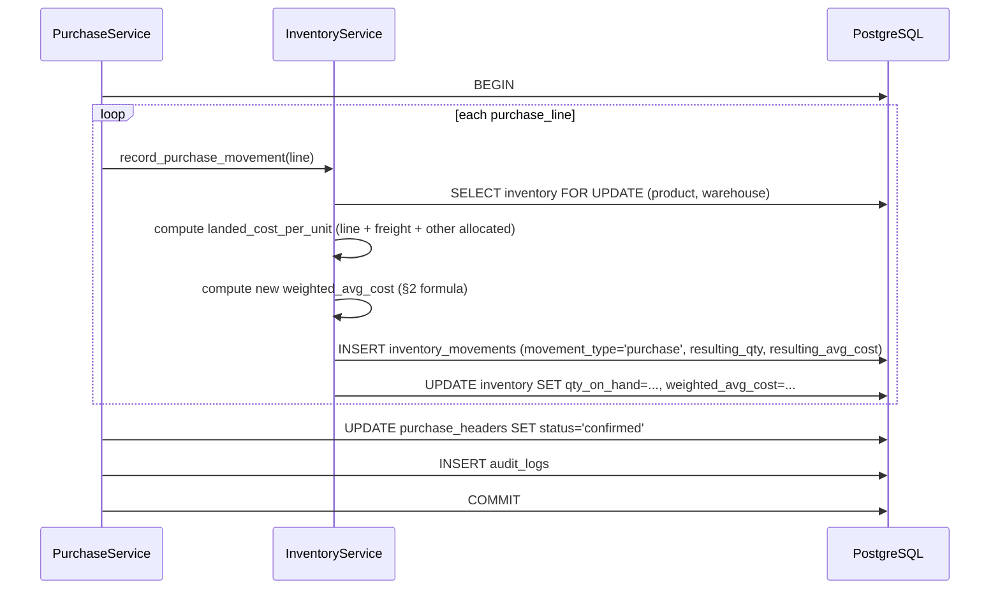

# 03 — Inventory

## 1. Source of truth vs. cache

`inventory_movements` (append-only, §3.14 in [02_Database.md](02_Database.md#inventory-tables))
is the **source of truth**. `inventory.qty_on_hand` and
`inventory.weighted_avg_cost` are a **materialized cache** of "replay
every movement for this (product, warehouse)". The cache exists purely
for read performance (`stock CODE` must answer in well under a second
even after years of movements); it is never written to directly by any
service method outside `InventoryService`, and every write to it
happens in the same transaction as the movement row that justifies it.

This split is why "inventory always balances" (an acceptance criterion
in [`CLAUDE.md`](../CLAUDE.md#acceptance-criteria)) is checkable, not
just hoped for: a nightly job recomputes the cache from movements and
diffs it against the live cache — see
[11_BackgroundWorkers.md #reconciliation](11_BackgroundWorkers.md#reconciliation).

## 2. Weighted Average Cost — the algorithm

**Why weighted average, not FIFO/LIFO:** the partners' existing mental
model (confirmed against the reference sheets) is "what did we pay on
average for the stock we're holding," not "which specific lot am I
selling." Weighted average is also the only costing method that
tolerates the reality of fabric trading, where individual rolls of the
same code/brand are not physically distinguished lot-to-lot once
stored. FIFO/LIFO would require lot tracking the business doesn't do
and doesn't want.

**Formula, applied on every purchase:**

```
new_avg_cost = (qty_on_hand * old_avg_cost + purchase_qty * purchase_landed_cost)
               / (qty_on_hand + purchase_qty)
```

Where `purchase_landed_cost` is **not** the raw purchase rate — it
includes allocated freight and other charges (see
[04_Purchases.md §4](04_Purchases.md#freight-allocation)):

```
purchase_landed_cost_per_unit = (line_total + freight_allocated + other_charges_allocated) / qty
```

**Worked example** (matches the reference sheet's TRP code):

| Event | Qty (KG) | Rate/landed cost | On hand after | Avg cost after |
|---|---|---|---|---|
| Opening | — | — | 100 | ₹150.00 |
| Purchase: 50 KG @ landed ₹160 | +50 | 160 | 150 | (100×150 + 50×160) / 150 = **₹153.33** |
| Sale: 30 KG | −30 | (avg cost unaffected by sales) | 120 | 153.33 (unchanged) |
| Purchase: 20 KG @ landed ₹140 | +20 | 140 | 140 | (120×153.33 + 20×140) / 140 = **₹151.43** |

**Sales never change the average cost** — they only reduce
`qty_on_hand`. This is the standard weighted-average rule and is
called out explicitly because it is the single most common
implementation bug in a first attempt (treating every movement, not
just purchase-type movements, as cost-affecting).

**Which movement types affect avg cost, and how:**

| `movement_type` | Changes `qty_on_hand` | Changes `weighted_avg_cost` |
|---|---|---|
| `purchase` | + | Yes (formula above) |
| `purchase_return` | − | Yes — reverses as if that purchase never happened; see §5 |
| `sale` | − | No |
| `sale_return` | + | No — added back **at the average cost at the time of the original sale** (`sales_lines.avg_cost_at_sale_time`), not today's average, so a return doesn't retroactively distort cost history |
| `adjustment_increase` | + | Yes, using the cost the user supplies (defaults to current avg cost if not specified) |
| `adjustment_decrease` | − | No |
| `damage` | − | No |
| `transfer_in` / `transfer_out` | ± | No (cost moves with the stock unchanged; a transfer is not a purchase or sale) |

## 3. Negative stock {#negative-stock}

A `sale` or `adjustment_decrease` movement that would take
`qty_on_hand` below zero is **blocked by default**, not silently
allowed and flagged after the fact — the business rule is that you
cannot sell fabric you don't have. The service raises
`InsufficientStockError` and the WhatsApp response is explicit:

```
⚠️ Can't complete this sale — TRP has 12.5 KG in stock, this sale needs 20 KG.
Reply "override" to sell anyway (will take stock negative) or correct the quantity.
```

**Override path exists** because physical reality sometimes leads the
system: a roll was weighed slightly wrong at purchase time, or the
partner is confident the OCR undercount will be corrected shortly. If
the user replies `override`, the sale proceeds, the resulting negative
`qty_on_hand` is allowed, and:
- The movement is tagged `flagged_negative_stock = true` (an
  additional boolean on the movement's audit metadata, stored in
  `audit_logs.after_state`, not a schema change to
  `inventory_movements` — negative stock is an *event to review*, not
  a first-class state the ledger needs a column for).
- A `dashboard`/`summary` response always surfaces any product
  currently at negative stock, so it can't be forgotten.
- The nightly low-stock scan (§7) treats negative stock as a distinct,
  more urgent alert than "below reorder level."

## 4. Returns, damage, and adjustments

- **Purchase return**: a `purchase_return` movement referencing the
  original `purchase_lines.id` as `source_id`. Reduces `qty_on_hand`
  and reverses the weighted average as if the returned quantity had
  never been purchased at that cost (recompute using the inverse of
  the formula in §2 — this can only be done exactly if the returned
  quantity's original landed cost is known, which it is, from
  `purchase_lines.landed_cost_per_unit`). If the return quantity
  exceeds what remains of that specific purchase's contribution (i.e.,
  most of the batch has already been sold and mixed with later
  purchases), exact reversal is mathematically impossible — the system
  instead reduces `qty_on_hand` and reduces `weighted_avg_cost` value
  proportionally, and flags the purchase return for manual review with
  a WhatsApp note explaining the approximation. This edge case is
  documented, not hidden.
- **Sale return**: see §2 table — added back at the historical sale
  cost, referencing `sales_lines.id`.
- **Damage**: a `damage` movement, always requires a `reason` (schema
  enforces `NOT NULL` when `movement_type = 'damage'` via a `CHECK`
  constraint: `CHECK (movement_type <> 'damage' OR reason IS NOT
  NULL)`), reduces `qty_on_hand`, does not affect avg cost, and is
  reported separately in the dashboard ("Damaged stock this month:
  ₹X") since it is a loss, not a normal cost of goods sold.
- **Manual adjustment**: `adjustment_increase`/`adjustment_decrease`,
  always requires `reason`, always requires `owner` role (staff cannot
  adjust stock directly — see [14_Security.md #rbac](14_Security.md#rbac)),
  always logged to `audit_logs` with channel visible in the weekly
  summary report so adjustments don't quietly become a way to paper
  over unexplained shrinkage.

## 5. Duplicate invoice detection — inventory-side consequence

Detection logic itself lives in
[04_Purchases.md #duplicate-detection](04_Purchases.md#duplicate-detection).
The inventory-relevant rule: **no `purchase` movement is ever created
until a `purchase_headers` row reaches `status = confirmed`**, and
confirmation is exactly the step where duplicate detection runs (see
the sequence diagram in
[01_Architecture.md §7](01_Architecture.md#7-request-flow-ocr-purchase-entry-asynchronous-path)).
This ordering guarantees a caught duplicate never touches inventory at
all — there is no compensating movement to reverse, because nothing
was written.

## 6. Mismatch detection {#mismatch-detection}

"Inventory mismatch" here means **the cached balance disagrees with
what a full replay of movements produces** — a bug, a manual DB
intervention, or (rarely) a race condition the transaction boundary
should have prevented. Detected by the nightly reconciliation job:

```sql
-- conceptual; actual implementation replays movements per (org_id, product_id, warehouse_id)
-- in application code so the weighted-average recompute logic (§2) is exercised identically
-- to the live code path, not duplicated as raw SQL.
SELECT product_id, warehouse_id,
       SUM(qty_delta) AS replayed_qty
FROM inventory_movements
WHERE org_id = :org_id
GROUP BY product_id, warehouse_id;
```

If `replayed_qty` (and the replayed avg cost) disagrees with the live
`inventory` row for any product, the job:
1. Does **not** silently overwrite the cache.
2. Creates a `settings`-configurable alert (WhatsApp message to every
   `owner`): "Stock mismatch detected for TRP: system shows 118.5 KG,
   ledger replay shows 120.0 KG. Not auto-corrected — please review."
3. Logs full detail (product, both values, timestamp) for engineering
   follow-up.
4. Exposes the mismatch on the admin dashboard until an `owner`
   explicitly acknowledges and triggers a recompute (a deliberate
   manual action, audited, never automatic) — see
   [10_API.md](10_API.md) `POST /inventory/reconcile`.

This is "detect inventory mismatches" from
[`CLAUDE.md`](../CLAUDE.md#intelligent-behaviors) made concrete: the
system never trusts its own cache blindly, and never silently patches
a financial number without a human decision.

## 7. Low stock alerts

- `products.reorder_level` (nullable — no alert configured if unset).
- Nightly Celery Beat job (`low_stock_scan`, see
  [11_BackgroundWorkers.md](11_BackgroundWorkers.md)) compares
  `inventory.qty_on_hand` against `reorder_level` per product; also
  checked synchronously immediately after any `sale` movement so a
  stock-out is flagged the moment it happens, not up to 24h later.
- Alert message groups all low-stock products in one message rather
  than one message per product, to avoid spamming WhatsApp:
  ```
  📉 Low stock alert (3 items):
  • TRP — 8.0 KG left (reorder at 15 KG)
  • MJP — 2.5 KG left (reorder at 10 KG)
  • NEG — −3.0 KG (⚠️ negative stock)
  ```
- Negative-stock items are always included regardless of
  `reorder_level` being set.

## 8. Multi-warehouse

- `warehouse_id` is present on `inventory` and `inventory_movements`
  from day one (§3.11/§3.14 in [02_Database.md](02_Database.md)); a
  single `"Main"` warehouse is seeded and marked `is_default`.
- Every WhatsApp command that doesn't explicitly name a warehouse
  resolves to the org's default warehouse — the two partners never
  need to think about warehouses until a second one is actually added.
- `transfer_in`/`transfer_out` are a matched pair of movements (same
  `source_id`, a new `stock_transfers` linking concept — modeled as
  two `inventory_movements` rows sharing a generated `transfer_id` in
  their `reason` metadata) created atomically in one transaction; a
  transfer can never partially apply.
- Weighted average cost is warehouse-scoped in the schema
  (`UNIQUE (org_id, product_id, warehouse_id)` on `inventory`) but a
  transfer carries cost with it unchanged, so the *organization-wide*
  average cost for a product (used in margin reports) is a qty-weighted
  roll-up across warehouses at report time, not a separately maintained
  number — avoids two sources of truth for "the" average cost.

## 9. Concurrency & locking

Two purchases or sales for the same product can be confirmed by the
two partners within seconds of each other from different phones. The
weighted-average recompute is a read-modify-write on `inventory` and
must not race:

- Every mutation to a specific `(org_id, product_id, warehouse_id)`
  inventory row acquires a row-level lock via
  `SELECT ... FOR UPDATE` on the `inventory` row at the start of the
  transaction, before computing the new average — standard Postgres
  pessimistic locking, appropriate here because contention is rare
  (two users) but correctness is non-negotiable (money math).
  Optimistic concurrency (version column + retry) was considered and
  rejected: with only two concurrent users the retry-storm risk
  optimistic locking is meant to avoid doesn't exist, and `FOR UPDATE`
  is simpler to reason about and test.
- If the `inventory` row does not yet exist for a `(product,
  warehouse)` pair (first-ever movement), it is created with
  `INSERT ... ON CONFLICT (org_id, product_id, warehouse_id) DO UPDATE
  ... RETURNING ...` inside the same locked transaction, so a race to
  create the first row for a brand-new product can't produce two rows
  or lose an update.

## 10. Edge cases (exhaustive)

- **Backdated purchase entry**: a purchase entered today with
  `invoice_date` two weeks ago, after other purchases/sales have
  already happened. Weighted average cost is **not** retroactively
  recalculated for movements that happened "after" this backdated one
  in wall-clock order — `inventory_movements` order is by
  `created_at` (when the system recorded it), not `invoice_date` (what
  the paper says). This is a deliberate simplification: true
  point-in-time backdated recosting would require replaying and
  rewriting every subsequent movement's average-cost snapshot, which
  makes the ledger mutable in spirit even if not in schema. Instead,
  the backdated purchase is recorded as of "now" for costing purposes,
  and the WhatsApp response says so explicitly: "Recorded with
  invoice date 10 Jul, but affects average cost starting now (14 Jul)
  since other transactions happened in between." This is called out
  as a known, intentional limitation — not a silent gap.
- **Zero-quantity or negative-quantity line**: rejected at input
  validation (`CHECK (qty > 0)` in schema; also validated pre-save in
  the service layer with a friendlier message than a raw constraint
  violation).
- **Product deleted (soft) while it still has stock**: soft-deleting a
  product with `qty_on_hand <> 0` requires explicit confirmation
  ("TRP still has 12 KG in stock — delete anyway?") and does not zero
  the inventory row; historical movements and the last known balance
  remain queryable, the product simply stops appearing in
  active-product lookups (`search`, OCR fuzzy matching, `stock`
  summary).
- **Two different products with visually similar codes** (e.g., `TRP`
  vs `TRP2`) causing OCR or manual-entry mix-ups: mitigated at the OCR
  fuzzy-matching layer ([07_OCR.md](07_OCR.md)), not at the inventory
  layer — by the time a movement is created, the product_id is already
  resolved and inventory has no way to know it's "wrong." This
  boundary is intentional: inventory correctness depends on upstream
  correctness, and each layer is responsible for what it can actually
  verify.
- **Fractional KG rounding across many small movements**: `NUMERIC(12,3)`
  for quantities and `NUMERIC(12,4)` for cost avoids float drift; the
  weighted-average formula is computed once per movement in `Decimal`
  arithmetic (Python), never accumulated through repeated float
  operations.
- **Sale return quantity exceeds original sale quantity**: rejected —
  `sales_lines.returned_qty + this_return_qty <= sales_lines.qty` is
  enforced in `SalesReturnService` before any movement is created.
- **Purchase confirmed, then immediately deleted (`undo`)**: reverses
  via a compensating movement (see [08_WhatsApp.md #undo](08_WhatsApp.md#undo)),
  never by deleting the original `purchase` movement row — the
  append-only property of `inventory_movements` is never violated, even
  for corrections.

## 11. Sequence diagram: purchase confirmation → inventory update



## 12. Performance considerations

- `stock CODE` and dashboard reads hit `inventory` (the cache), never
  `inventory_movements` directly — O(1) lookup regardless of history
  length.
- Full movement history (`ledger CODE`, audit drill-down) paginates
  `inventory_movements` using the `idx_inventory_movements_product_warehouse`
  index (§7 in [02_Database.md](02_Database.md#indexes)), newest first,
  cursor-paginated by `created_at` rather than `OFFSET`, so deep
  history pages stay fast.
- Nightly reconciliation (§6) is the one job allowed to do a full
  table scan of `inventory_movements`; it runs in the low-traffic
  window (see [11_BackgroundWorkers.md](11_BackgroundWorkers.md)) and
  is partitioned-by-month aware (only rescans partitions touched since
  the last successful run, tracked in a `reconciliation_runs` table)
  once movement volume makes a full scan noticeably slow — not needed
  at current two-user scale, but the partitioning from
  [02_Database.md §9](02_Database.md#9-performance-considerations-specific-to-this-schema)
  makes this optimization a query change, not a schema change, when
  it's needed.
