# 07 — OCR Pipeline

## 1. Pipeline overview

```mermaid
flowchart LR
    A[Raw image/PDF] --> B[Preprocess\nOpenCV]
    B --> C[Table detection]
    C --> D[Cell extraction]
    D --> E[Header detection\n+ template resolution]
    E --> F[OCR per cell\nPaddleOCR / Tesseract]
    F --> G[Confidence scoring]
    G --> H[Fuzzy matching\nagainst products +\nlearning dictionary]
    H --> I[Draft purchase\n+ flagged low-confidence cells]
    I --> J[User confirms/corrects\nover WhatsApp]
    J --> K[Learning dictionary update]
```



Implemented in `backend/ocr/`, deliberately independent of
FastAPI/Celery (see
[01_Architecture.md §3](01_Architecture.md#3-component-responsibilities))
so every stage is unit-testable against fixture images without
standing up the full app.

## 2. Image preprocessing {#preprocessing}

Module: `backend/ocr/preprocess.py`. Input: raw bytes (JPEG/PNG from
WhatsApp media, or a PDF page rendered to an image via `pdf2image`).

1. **Format normalization**: PDFs are rendered to PNG at 300 DPI per
   page (each page processed as a separate attachment-derived job if
   multi-page — see §10 edge cases). Images are loaded via OpenCV
   (`cv2.imread`) in BGR, immediately converted to grayscale for the
   geometry stages (color is not needed for a printed/handwritten
   B&W-ish purchase sheet; retained separately only if a future
   product type needs color-coded cues).
2. **Deskew**: detect dominant text-line angle via
   `cv2.minAreaRect` on thresholded contours (Otsu's threshold), rotate
   to correct — phone photos are rarely perfectly aligned, and skew
   above ~2° measurably degrades both table-line detection and OCR
   accuracy.
3. **Denoise**: `cv2.fastNlMeansDenoising` (grayscale) to remove
   phone-camera sensor noise and JPEG compression artifacts, tuned
   conservatively (light denoising) since aggressive denoising blurs
   thin table gridlines and small digits.
4. **Adaptive thresholding**: `cv2.adaptiveThreshold` (Gaussian,
   block size tuned per empirical testing against the reference
   sheets) rather than a single global threshold — purchase sheet
   photos routinely have uneven lighting across the frame (shadow from
   the phone or the hand holding it), and a global threshold blows out
   one side of the sheet.
5. **Crop**: detect the largest rectangular contour (the sheet/table
   boundary) via `cv2.findContours` + `cv2.approxPolyDP`, perspective-
   transform (`cv2.getPerspectiveTransform` +
   `cv2.warpPerspective`) to a flat top-down rectangle — corrects for
   the sheet being photographed at a slight angle to the camera, not
   just rotated in-plane (that's deskew; this is perspective).
6. Output: a normalized, cropped, deskewed, thresholded image, plus the
   original (kept for the stored `attachments` row and for manual
   review if automated parsing fails badly).

## 3. Table detection

Module: `backend/ocr/table_detect.py`.

- Detect horizontal and vertical line segments via morphological
  operations (`cv2.erode`/`cv2.dilate` with long thin structuring
  elements, a standard technique for table-grid extraction) to build a
  line mask, then find line intersections to derive the grid of cell
  boundaries.
- **Sheets with no visible ruled lines** (some supplier sheets are
  plain text in columns, not a drawn grid — confirmed as a real case
  from the reference samples): falls back to **column detection via
  whitespace-gap analysis** — project ink density onto the horizontal
  axis, find consistent vertical whitespace gaps across rows, treat
  those as column boundaries. This fallback is why table detection is
  a two-strategy step, not a single algorithm assumed to always find
  ruled lines.
- If neither strategy produces a confident grid (measured by: do the
  detected column boundaries align consistently across ≥70% of
  detected text-row bands?), table detection reports failure and the
  pipeline routes to manual entry (§9, the `C -- No` branch in
  [04_Purchases.md §2](04_Purchases.md#2-purchase-entry-flow-ocr-first-manual-fallback))
  rather than forcing a bad grid onto garbled output.

## 4. Cell extraction

Each detected grid cell is cropped out as its own sub-image, with a
small padding margin (avoids clipping ascenders/descenders at cell
edges). Cells are grouped into rows in reading order (top-to-bottom,
left-to-right within a row) using the grid coordinates from table
detection — this ordering is what lets the pipeline reassemble
"row 3, column 2" into a coherent purchase line later.

## 5. Header detection and template resolution {#templates}

The **first 1–2 rows** of the detected grid are treated as header
candidates. Each header cell's OCR'd text is compared (fuzzy, via
`rapidfuzz.fuzz.ratio`, threshold ≥0.7) against the `header_aliases`
lists declared in the active `ocr_templates.column_mapping`
([02_Database.md §3.8](02_Database.md#38-ocr_templates-ocr-templates)).

**Template resolution order**: `(product_type, supplier)` exact match
→ `(product_type, NULL)` default → if the org has only one active
`product_type` (true for the textile-only business at launch), that
type's default template is assumed even before a supplier is known,
so header matching can run before the supplier name itself has been
extracted from the sheet (supplier is usually *not* a table column —
it's free text elsewhere on the sheet or supplied by the user).

**Textile default template (`column_mapping`), matching the reference
sheets exactly:**

```json
[
  { "field": "ignore", "header_aliases": ["s.no", "sno", "sr.no", "#"] },
  { "field": "qty", "header_aliases": ["qty", "quantity", "qnty"] },
  { "field": "description", "header_aliases": ["description", "desc", "item", "particulars"] },
  { "field": "code", "header_aliases": ["code", "item code", "design"] },
  { "field": "ignore", "header_aliases": ["label"] },
  { "field": "weight_kg", "header_aliases": ["kg", "wt", "weight"] },
  { "field": "total_weight_kg", "header_aliases": ["t.kg", "total kg", "tot kg", "total weight"] },
  { "field": "ignore", "header_aliases": ["total", "amount", "value"] }
]
```

If a detected header column matches none of the template's aliases
above the fuzzy threshold, it is **not silently dropped** — it's
surfaced to the user once as an unrecognized-column notice ("I see a
column that might be 'Rate' — should this map to something, or is it
fine to ignore?"), and a confirmed answer can be saved back as a new
`header_aliases` entry on the template (an `owner`-approved template
edit, not automatic — templates are shared across every future
purchase from that supplier, so a wrong auto-learned mapping would
have lasting consequences, unlike the OCR learning dictionary in §8
which corrects individual cell values, not the structural template).

## 5b. Claude vision as the primary reader {#vision}

> **This section supersedes §6 in production.** §6 describes the local
> pipeline, which is now the *fallback*. The vision engine landed after
> this document was first written; what follows reconciles them.

`backend/ocr/vision_engine.py` reads the sheet with `claude-opus-5`
instead of detecting a grid and OCR-ing cells. It is tried first when
`OCR_USE_VISION=true` and an `ANTHROPIC_API_KEY` is present; any failure
— no key, a refusal, a transport error, zero rows — falls through to
§1–§6 unchanged.

**Why it is primary.** The local pipeline's accuracy is bounded by grid
detection on a photographed sheet, and that failure mode is the
dangerous kind: a merged column boundary shifts every field silently,
producing a plausible table with the wrong numbers in it. A vision model
reads the table *as a table*, so unnamed columns, uneven lighting and a
slight angle stop being failure modes. On the partners' real 26-row
sheet: vision 26/26, local 20/26.

**What it does not change.** It emits the same `ExtractedRow` shape the
local pipeline produces, so everything downstream — noise-row rejection,
the qty × kg cross-check (§5), product matching (§9), the learning
dictionary (§8) — runs identically. The two engines are
interchangeable, which is what keeps this a swap rather than a second
pipeline.

**Numbers come back as strings** and are parsed with `Decimal`. A float
anywhere here would violate the money/quantity rule before the value
ever reached the draft.

**Cost and latency.** Roughly $0.05 and ~18s per sheet. That cost is why
[20_ConversationalIntake.md §2](20_ConversationalIntake.md#flow) asks
what a photo *is* before reading it: a mis-sent picture must not spend a
vision call. Setting `ANTHROPIC_API_KEY` empty cleanly reverts to local
OCR with no other change.

**Confidence.** Vision does not return per-cell confidence the way
PaddleOCR does, so §7's composite score is not computed for it. The
cross-checks that catch real errors — qty × kg disagreeing with the
stated total, a code that matches no product — are arithmetic and
catalogue lookups, and they run either way. Handwriting confirmation
(20_ConversationalIntake.md §6) is the planned counterpart for the
low-confidence numeric case.

## 6. OCR engine: dual-engine strategy {#dual-engine-strategy}

> The local pipeline. Primary only when vision is disabled or
> unavailable — see [§5b](#vision).


- **Primary: PaddleOCR** (`PP-OCRv4` recognition model, angle
  classifier enabled) run per cell (not per whole image — running per
  cell after table detection is both faster, since each cell is small,
  and more accurate, since the recognizer isn't fighting with
  cross-cell layout ambiguity).
- **Fallback: Tesseract** (`pytesseract`, `--psm 7` — single text line,
  appropriate for a single table cell) is run on any cell where
  PaddleOCR's own confidence score falls below
  `settings.ocr_engine_fallback_threshold` (default 0.75). The two
  engines are complementary in practice: PaddleOCR's CRNN-based
  recognizer tends to do better on stylized/varied fonts across
  different printers, while Tesseract's LSTM engine sometimes wins on
  very clean, uniformly-spaced typewritten/dot-matrix-style text
  common on older-style supplier invoice templates — running both and
  preferring the higher-confidence result on disagreement (rather than
  a fixed "always trust engine X") is what the fallback threshold
  achieves.
- **Numeric cells** (`qty`, `weight_kg`, `total_weight_kg`) are
  additionally post-processed with a digit-only regex normalization
  pass (strip anything that isn't `[0-9.,]`, then normalize comma/
  decimal separators) before being parsed as `Decimal`, since OCR
  engines occasionally emit a stray character (`l` for `1`, `O` for
  `0`) — a raw digit-confusion substitution table
  (`{'O':'0','o':'0','l':'1','I':'1','S':'5','B':'8'}`) is applied
  *only* to numeric-field cells, never to `code`/`description` cells
  where those characters can be legitimately meaningful.

## 7. Confidence scoring {#confidence-scoring}

Each extracted cell gets a composite confidence score in `[0, 1]`:

```
cell_confidence = w1 * ocr_engine_confidence
                 + w2 * table_grid_confidence   (how clean was this cell's boundary detection)
                 + w3 * fuzzy_match_confidence   (for code/description: how well did it match a known product)
where w1=0.5, w2=0.2, w3=0.3 (code/description cells);
      w1=0.7, w2=0.3, w3=0 for pure-numeric cells (no fuzzy match applies)
```

A **line's** overall confidence is the minimum of its cells' scores
(a chain-is-as-strong-as-its-weakest-link rule — a line with one
badly-read cell is a line that needs review, even if the other four
cells were perfect).

**Thresholds** (configurable via `settings`):
- `>= 0.90`: auto-accepted, shown in the preview without a flag.
- `0.60 – 0.89`: shown in the preview **with an inline flag** (e.g.,
  `TRP ⚠️`) and the specific low-confidence field highlighted;
  included in the draft but the user is nudged to double check before
  confirming.
- `< 0.60`: **not auto-filled** — the field is left blank in the draft
  with an explicit prompt ("Line 3, Code: couldn't read this clearly —
  what should it be?") rather than guessing and hoping the user
  notices a wrong auto-fill. This threshold split exists because a
  wrong silent guess is worse than an honest blank: a blank demands
  attention, a wrong guess can slip through confirmation unnoticed.

## 8. Auto-correction and the learning dictionary {#learning-dictionary}

**Auto-correction at read time**: before falling back to "ask the
user," a low/medium-confidence `code` or `description` cell is checked
against `ocr_learning_dictionary`
([02_Database.md §3.9](02_Database.md#39-ocr_learning_dictionary-ocr-learning-dictionary))
for an exact match on `(org_id, supplier_id OR NULL, field,
raw_ocr_text)`. A hit auto-applies the known correction and is shown
in the preview as auto-corrected (visibly, e.g. `TRP ✓ (auto-corrected
from "TRD")`), not silently substituted — the user always sees what
happened, even when the system is confident, because trust is built by
transparency, not by hiding the mechanism.

**Learning on user correction**: whenever a user corrects a field
during the confirmation flow
([04_Purchases.md §2](04_Purchases.md#2-purchase-entry-flow-ocr-first-manual-fallback)),
`PurchaseService` calls
`OcrLearningService.record_correction(org_id, supplier_id, field,
raw_ocr_text, corrected_value)`:

```sql
INSERT INTO ocr_learning_dictionary (org_id, supplier_id, field, raw_ocr_text, corrected_value, hit_count)
VALUES (:org_id, :supplier_id, :field, :raw_ocr_text, :corrected_value, 1)
ON CONFLICT (org_id, supplier_id, field, raw_ocr_text)
DO UPDATE SET hit_count = ocr_learning_dictionary.hit_count + 1, updated_at = now();
```

- Supplier-specific entries (`supplier_id` set) take priority over
  org-wide entries (`supplier_id IS NULL`) when both match, since the
  same raw OCR misreading can mean different things from different
  suppliers' sheets (different fonts/printers produce different
  characteristic misreadings).
- `hit_count` is surfaced in the admin dashboard as a simple
  confidence signal for humans reviewing the dictionary (a correction
  applied 40 times is far more trustworthy than one applied once), but
  is **not** currently used to auto-*expire* low-hit entries — a
  single correct correction is still correct; this is flagged as a
  potential future refinement (pruning stale/wrong entries an `owner`
  later un-confirms) rather than built speculatively.

## 9. Fuzzy matching against the product catalog

Independent of the learning dictionary (which matches *raw OCR text*
to a *known correction*), every `code` field is also fuzzy-matched
directly against `products.code` for the org
(`pg_trgm` similarity, threshold ≥0.85 for auto-accept,
0.6–0.85 shown as a suggested correction: "Did you mean TRP (existing
product)?"). `description` is matched the same way against
`products.description`. This second, independent matching path exists
because the learning dictionary only knows about *previously seen*
misreadings — a first-time misread of a code still has a chance to
resolve correctly by similarity to the existing catalog, without
having to be manually corrected once first.

## 10. Manual correction flow (WhatsApp)

Corrections during the preview/confirmation step use a simple,
line-referenced syntax so a partner can fix one cell without retyping
the whole table:

```
line 3 code TRP2
line 3 description Trouser Poly Wide
line 1 qty 105
```

Each correction re-renders the updated preview and is applied to the
in-memory/`draft`-status `purchase_lines` row immediately — nothing is
finalized until `CONFIRM`. Full command handling in
[08_WhatsApp.md](08_WhatsApp.md#ocr-correction-syntax).

## 11. Duplicate invoice detection at the OCR stage

Two checks happen *before* the user is even asked to confirm, so a
duplicate is caught as early as possible rather than after data entry
effort has been spent:

1. **Photo-hash duplicate** (§6 in
   [04_Purchases.md](04_Purchases.md#6-duplicate-invoice-detection-duplicate-detection)) —
   checked immediately on upload, before OCR even runs, since it needs
   no OCR output at all.
2. Once OCR has extracted `invoice_no` (if present as a manual field or
   readable on the sheet) and `supplier` is known, the same
   fuzzy-duplicate logic from
   [04_Purchases.md §6](04_Purchases.md#6-duplicate-invoice-detection-duplicate-detection)
   runs against the OCR-derived draft *before* presenting the preview,
   so the preview message itself can lead with the duplicate warning
   rather than surfacing it as a surprise after the user has already
   reviewed and typed "CONFIRM."

## 12. Edge cases (exhaustive)

| Case | Handling |
|---|---|
| **Rotated image** (sideways/upside-down photo) | PaddleOCR's angle classifier detects and corrects 0°/90°/180°/270° rotation as part of cell recognition; whole-image orientation is additionally estimated from the largest detected contour's aspect ratio pre-crop (§2 step 5) so table detection itself isn't fed a sideways image. |
| **Multi-page PDF** | Each page is treated as a **separate attachment** and a separate purchase draft by default (most multi-page purchase PDFs in practice are separate invoices); if the pipeline detects that page 2's header row exactly matches page 1's (continuation of the same table), it offers to merge them into one purchase draft instead — offered, not assumed. |
| **Handwritten annotations** (a supplier has scribbled a correction on the printed sheet) | Printed-text OCR models perform poorly on handwriting; handwritten cells score very low confidence and fall into the `<0.60` "ask the user" bucket (§7) rather than attempting to guess — no separate handwriting model is included in v1, since the reference sheets are predominantly printed/typed. |
| **Poor lighting / shadow across the sheet** | Adaptive thresholding (§2 step 4) handles moderate cases; severe cases (half the sheet unreadable) result in low grid/cell confidence across many cells, which surfaces as a large number of "ask the user" prompts rather than a cryptic failure — if more than `settings.ocr_manual_field_ratio_threshold` (default 40%) of cells are sub-0.60, the pipeline proactively suggests "This photo is hard to read — want to retake it, or continue correcting manually?" instead of asking 15 individual questions. |
| **Partial table cutoff** (bottom rows missing from the photo) | Detected when the last detected row doesn't reach a natural table-bottom boundary (no closing horizontal line, and the row band abuts the image edge) — flagged explicitly: "This looks like it might be missing some rows at the bottom — reply 'that's all' or send another photo of the rest." |
| **Two-column purchase sheet** (some suppliers print two side-by-side item tables per page to save paper) | Table detection (§3) can produce two separate grids; both are extracted, and lines are merged in left-table-then-right-table reading order into one purchase draft, with row numbering continuing across the merge — verified against a fixture matching this real layout variant. |
| **Non-textile product type using a different unit** (future) | Handled entirely by template resolution (§5) — a `hardware` product type's `ocr_templates` row simply omits `weight_kg`/`total_weight_kg` fields and includes whatever columns that sheet actually has (e.g., `size`, `pcs`); the preprocessing/detection/OCR stages are completely unaware of product type, only the column-mapping stage is template-driven. |
| **OCR confidently reads a code that doesn't exist and isn't a close fuzzy match to anything** | Treated as a new-product candidate, per [04_Purchases.md §7](04_Purchases.md#7-validation-rules-exhaustive) — asked, never auto-created. |
| **Image is not a purchase sheet at all** (wrong photo sent) | If table detection fails *and* no text resembling known headers is found anywhere on the page, the pipeline reports "I couldn't find a purchase table in this image" rather than forcing a manual-entry flow the user didn't ask for — offers manual entry as an option, doesn't assume it's wanted. |

## 13. Performance

- Target: OCR result (draft ready for WhatsApp preview) within
  **10 seconds** of upload for a typical single-page sheet (15–25 line
  items, the range seen in the reference samples), on the CPU-only
  deployment target described in
  [01_Architecture.md §11](01_Architecture.md#11-performance--scalability-considerations).
- Preprocessing (§2) is the cheapest stage (<1s); table detection
  (§3) and header resolution (§5) are near-instant; per-cell OCR (§6)
  dominates the budget — parallelized across cells within a single
  image using a bounded worker pool inside the Celery task (not a
  separate Celery task per cell — that would add more queuing overhead
  than it saves for a ~100-cell sheet) via `concurrent.futures.ThreadPoolExecutor`
  sized to available CPU cores, since PaddleOCR/Tesseract calls release
  the GIL during their C/C++ inference internals.
- No GPU dependency by design (§ referenced above) — this keeps
  deployment to the single small server in
  [16_Deployment.md](16_Deployment.md) without a GPU-enabled base
  image or driver stack, at the cost of per-image latency that would
  be lower on a GPU; acceptable because purchase entry is not a
  high-frequency, high-concurrency workload for a two-partner business.

## 14. Testing strategy specific to OCR

Full detail in [15_Testing.md §OCR](15_Testing.md#ocr-accuracy-benchmarks);
summary: a fixture corpus built from the reference sample sheets
(`wagdia textile company.xlsx`-derived rendered images,
`Textile_Inventory_Template.xlsx`-derived images, plus deliberately
degraded variants — rotated, low-light, partially cropped — generated
from the same fixtures) is run through the full pipeline in CI, with
field-level accuracy asserted against hand-labeled ground truth for
each fixture. A regression in accuracy on any fixture fails CI — OCR
accuracy is treated as a testable contract, not a "good enough,
ship it" judgment call.
