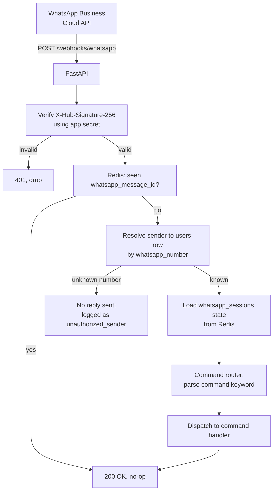
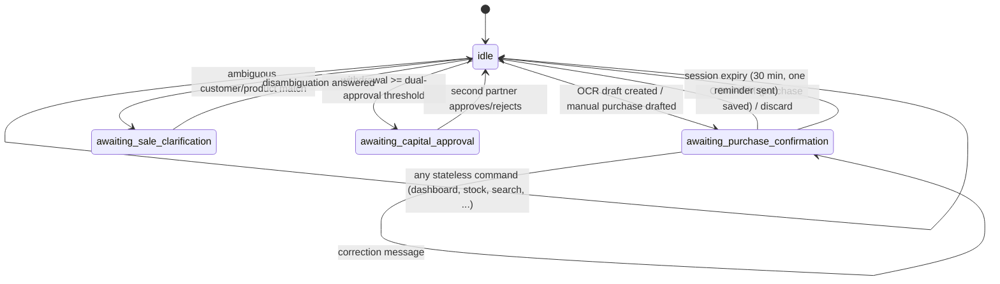

# 08 — WhatsApp Interface

## 1. Webhook architecture



- Webhook verification uses Meta's standard challenge/response
  handshake at setup time (`GET /webhooks/whatsapp?hub.verify_token=...`)
  and HMAC-SHA256 payload signature verification
  (`X-Hub-Signature-256`) on every inbound POST — see
  [14_Security.md #whatsapp-sender-verification](14_Security.md#whatsapp-sender-verification).
- The webhook handler always returns `200 OK` within 5 seconds once
  signature verification and dedup pass, per
  [01_Architecture.md §8](01_Architecture.md#8-idempotency-and-delivery-guarantees) —
  slow work (OCR, report generation) is Celery-dispatched, with an
  immediate WhatsApp acknowledgment message sent separately.

## 2. Sender resolution {#sender-resolution}

Every inbound message's `from` number is normalized to E.164 and
looked up against `users.whatsapp_number`. An unrecognized number
receives **no reply at all** (not even an error) — silently dropping
unknown senders (after logging, for security review) avoids the bot
being usable as an oracle by strangers who message the business
number, and avoids leaking "this system exists and responds to
commands" to unauthenticated parties. This is a deliberate asymmetry
with every other error case in this doc, which do reply — an unknown
sender is not a user making a mistake, it's outside the trust boundary
entirely.

## 3. Message deduplication {#message-deduplication}

Two distinct dedup mechanisms, at two different layers, for two
different failure modes:

| Layer | Keyed by | Catches | TTL |
|---|---|---|---|
| Transport-level (webhook) | `whatsapp_message_id` (Meta-assigned, unique per message) | Meta redelivering the *same webhook event* (network retry on their side) | 24h, Redis |
| Application-level (sales only, see [05_Sales.md §5](05_Sales.md#5-duplicate-sale-detection-duplicate-sale-detection)) | `sha256(sender + normalized text)` | The *user* sending the same logical command twice (double-tap, resend after "did that go through?") | `settings.sale_dedup_window_minutes`, default 10 |

Both are necessary: transport dedup alone would not catch a user
manually retyping/resending; application dedup alone would not catch
Meta's own retries arriving with a *new* delivery attempt but
identical `whatsapp_message_id` semantics before the app has even
started processing the first.

## 4. Permissions model (referenced by every command below)

Full RBAC matrix: [14_Security.md #rbac](14_Security.md#rbac). Summary
used throughout this doc:
- **owner** — full access to every command, including overrides.
- **staff** — can use transactional commands (`purchase`, `sale`,
  `return`, `expense`, `income`, `received`, `paid`, `search`,
  `stock`) but cannot use `capital`, `withdraw`, `settings`,
  `restore`, `delete` on confirmed records, or override
  duplicate/credit-limit/below-cost warnings.
- **viewer** — WhatsApp access not applicable (dashboard-only role).

## 5. Session state machine {#session-state-machine}

Backed by `whatsapp_sessions` ([02_Database.md §3.20](02_Database.md#320-whatsapp_sessions)),
cached in Redis (source of low-latency truth) and mirrored to Postgres
(durability across a Redis restart).



- Session TTL: 30 minutes of inactivity (`settings.session_timeout_minutes`),
  after which state resets to `idle` and one reminder message is sent
  (per [04_Purchases.md §10](04_Purchases.md#10-failure-scenarios)) —
  never silently dropped without notice, since an abandoned draft
  represents real unsaved work.
- Only one active non-idle session per user at a time — starting a new
  stateful flow (e.g., a purchase) while another is pending
  (e.g., an unconfirmed sale) prompts the user to finish or discard the
  first, rather than interleaving two multi-turn conversations, which
  would be confusing to both the user and the parser.

## 6. Command reference

Each command below documents syntax, examples, success/error
responses, permissions, validation, and edge cases. Numeric/date
formats: quantities up to 3 decimals, currency to 2 decimals, dates
`DD-MM-YYYY` (matches the partners' existing convention), all times
displayed in `organizations.timezone`.

---

### `purchase` {#purchase}

**Syntax:** send a photo (OCR path, see [07_OCR.md](07_OCR.md)) or:
```
purchase Supplier: <name> Invoice: <no> Date: <DD-MM-YYYY> [Brand: <name>]
<CODE> <qty> <rate>
...
Freight: <amount>
Other: <amount>
```
**Example:** see [04_Purchases.md §3](04_Purchases.md#3-manual-purchase-command-fallback--non-ocr-entry).

**Success:** draft preview + `Reply CONFIRM to save`.
**Errors:** unresolved supplier/product (asks to create), total
mismatch (§ [04_Purchases.md §5](04_Purchases.md#5-total-mismatch-detection-total-mismatch)),
duplicate invoice (§ [04_Purchases.md §6](04_Purchases.md#6-duplicate-invoice-detection-duplicate-detection)),
empty line list ("Send at least one item line").
**Permissions:** owner, staff. Duplicate-warning override: owner only.
**Validation / edge cases:** [04_Purchases.md §7, §10](04_Purchases.md#7-validation-rules-exhaustive).

---

### `sale` {#sale}

**Syntax/example:** [05_Sales.md §2](05_Sales.md#2-sale-command-grammar-grammar).
**Success:** immediate confirmation (no explicit CONFIRM step needed
unless a warning fires — see §7 of this doc).
**Errors:** insufficient stock (override available), below-cost
warning, credit-limit warning, unresolved customer/product.
**Permissions:** owner, staff. Below-cost/credit-limit override: owner
only (staff is told to escalate).
**Validation / edge cases:** [05_Sales.md §9, §10](05_Sales.md#9-validation-rules-exhaustive).

---

### `return` {#return}

**Syntax:**
```
return purchase <invoice-no or "last"> <CODE> <qty> [reason: <text>]
return sale <customer name or "last"> <CODE> <qty> [reason: <text>]
```
**Example:** `return sale ABC TRP 5 reason: wrong color shipped`
**Success:**
```
✅ Return recorded — 5 KG TRP from ABC's sale (24-07-2026)
ABC's outstanding reduced by ₹825.00 (now ₹3,575.00)
Stock after: TRP 135.0 KG
```
**Errors:** return qty exceeds original sold/purchased qty; no
matching recent transaction found ("last" resolves to the most recent
transaction with that counterparty within 7 days — if none, asks for
an explicit invoice/date).
**Permissions:** owner, staff (staff can return their own recent
entries; returns against transactions older than 24h require owner).
**Edge cases:** refund-vs-credit prompt for already-paid sales, §
[05_Sales.md §6](05_Sales.md#6-sale-returns); partial-batch purchase
return approximation, §
[03_Inventory.md §4](03_Inventory.md#4-returns-damage-and-adjustments).

---

### `expense` {#expense}

**Syntax:** `expense <category> <amount> <cash|bank> [description]`
**Example:** `expense transport 1500 cash loading charges for July batch`
**Success:** `✅ Expense recorded — Transport ₹1,500.00 (cash). Cash
balance now ₹18,500.00.`
**Errors:** amount `<= 0` rejected; unrecognized category is accepted
as free text (categories are not a closed enum — see
[06_Accounting.md §2](06_Accounting.md#2-chart-of-accounts-v1), any
text becomes the `expenses.category` value, normalized to lowercase
for later grouping in reports) but suggests close matches to existing
categories to avoid accidental fragmentation ("rent" vs "Rent" vs
"rents").
**Permissions:** owner, staff.
**Edge cases:** `paid_by_partner_id` variant — `expense transport 1500
cash paid by Rahul` records it against that partner's capital per
[06_Accounting.md §13](06_Accounting.md#13-edge-cases).

---

### `income` {#income}

**Syntax:** `income <category> <amount> <cash|bank> [description]`
**Example:** `income interest 300 bank`
**Success/Errors/Permissions:** mirrors `expense` exactly (§ above),
posting to `income` instead.

---

### `capital` {#capital}

**Syntax:** `capital <partner name> <amount> <cash|bank> [contribution|withdrawal]`
(defaults to `contribution` if omitted — a bare `capital` entry adding
funds is far more common than a withdrawal, and withdrawal has its own
dedicated command below for clarity anyway).
**Example:** `capital Rahul 50000 bank contribution`
**Success:** `✅ Capital contribution recorded — Rahul +₹50,000.00
(bank). Rahul's capital balance now ₹2,15,000.00.`
**Errors:** unresolved partner name; negative/zero amount rejected.
**Permissions:** owner only.
**Edge cases:** large withdrawals routed through `withdraw` (below),
not through `capital ... withdrawal`, to keep the dual-approval path
unambiguous — `capital` with `withdrawal` explicitly stated below the
dual-approval threshold is still accepted as a shorthand, above the
threshold it redirects to the `withdraw` flow.

---

### `withdraw` {#withdraw}

**Syntax:** `withdraw <partner name> <amount> <cash|bank>`
**Example:** `withdraw Rahul 30000 bank`
**Success (below threshold):** immediate, same style as `capital`.
**Success (at/above threshold, per [06_Accounting.md §8](06_Accounting.md#8-partner-capital-accounting)):**
```
🔒 This withdrawal (₹30,000.00) needs approval from another partner
before it's processed. Waiting on: Farida.
```
— and a message is sent to the other active partner(s):
```
Rahul requested a capital withdrawal of ₹30,000.00 (bank).
Reply "approve withdraw <id>" or "reject withdraw <id>".
```
**Errors:** insufficient capital balance is a warning, not a block
(consistent with §13 in [06_Accounting.md](06_Accounting.md#13-edge-cases) —
a negative capital balance is allowed, just flagged).
**Permissions:** owner only (both requesting and approving).
**Edge cases:** requester cannot approve their own withdrawal (checked
even if, implausibly, both partner accounts were somehow accessible
from one number); approval request expires after 48h
(`settings.withdrawal_approval_timeout_hours`) and must be re-requested.

---

### `received` {#received}

**Syntax:** `received Customer: <name> <amount> <cash|bank> [against <invoice-ref>]`
**Example:** `received Customer: ABC 2000 cash`
**Success:**
```
✅ Payment received — ABC ₹2,000.00 (cash), applied to INV-oldest-first
ABC's outstanding now ₹2,400.00 (was ₹4,400.00)
```
**Errors:** overpayment beyond total outstanding → confirm-as-advance
prompt, per [04_Purchases.md §9](04_Purchases.md#9-payment-tracking)
(same pattern, receivable side).
**Permissions:** owner, staff.
**Edge cases:** FIFO settlement order, explicit `against` override —
[05_Sales.md §7](05_Sales.md#7-partial-payments-against-credit-sales).

---

### `paid` {#paid}

**Syntax:** `paid Supplier: <name> <amount> <cash|bank> [against <invoice-ref>]`
**Example:** `paid Supplier: Shree Textiles 10000 bank against INV-4521`
**Success/Errors/Permissions:** mirrors `received` exactly, payable
side — [04_Purchases.md §9](04_Purchases.md#9-payment-tracking).

---

### `dashboard` {#dashboard}

**Syntax:** `dashboard`
**Success:** see full layout in
[12_Dashboard.md §3](12_Dashboard.md#3-whatsapp-dashboard-output-format).
**Permissions:** owner, staff (staff sees everything except partner
capital balances, per RBAC — [14_Security.md](14_Security.md#rbac)).
**Performance:** served from Redis cache, target <3s per
[00_ProjectVision.md §8](00_ProjectVision.md#8-success-metrics).

---

### `summary` {#summary}

**Syntax:** `summary [today|week|month|<DD-MM-YYYY> to <DD-MM-YYYY>]`
(defaults to `today`).
**Example:** `summary week`
**Success:** condensed P&L-style digest for the period — purchases,
sales, expenses, net cash movement, notable warnings triggered during
the period (duplicates caught, below-cost sales confirmed, negative
stock events). Full spec: [13_Reports.md §3](13_Reports.md#3-summary-vs-full-reports).
**Permissions:** owner, staff.

---

### `stock` {#stock}

**Syntax:** `stock` (full list) or `stock <CODE>` (single product,
[08_WhatsApp.md #stock-code](08_WhatsApp.md#stock-code)).
**Success (`stock` alone):**
```
📦 Stock summary (23 active products)
Total value: ₹4,52,300.00
Low stock: 3 items (reply "stock low" to see them)
Negative stock: 1 item ⚠️ (reply "stock negative" to see them)
```
Full list is paginated (`stock all`), not dumped in one message, to
stay within WhatsApp's practical message-length comfort zone.
**Permissions:** owner, staff.

---

### `stock CODE` {#stock-code}

**Syntax:** `stock <CODE>`
**Example:** `stock TRP`
**Success:**
```
📦 TRP — Trouser Poly (Wagdia)
On hand: 130.0 KG
Avg cost: ₹153.21/KG
Stock value: ₹19,917.30
Reorder level: 15.0 KG
Last movement: sale −20.0 KG (24-07-2026)
```
**Errors:** unresolved code → fuzzy suggestions ("Did you mean TRP?").
**Permissions:** owner, staff.

---

### `supplier NAME` {#supplier-name}

**Syntax:** `supplier <name>`
**Example:** `supplier Shree Textiles`
**Success:**
```
🏭 Shree Textiles
Outstanding payable: ₹14,000.00
  0–30d: ₹14,000.00 · 31–60d: ₹0 · 61–90d: ₹0 · 90+d: ₹0
Last purchase: INV-4521, 24-07-2026, ₹24,000.00
Purchases this month: 3 (₹58,200.00 total)
```
**Permissions:** owner, staff.

---

### `customer NAME` {#customer-name}

**Syntax:** `customer <name>` — mirrors `supplier NAME`, receivable
side, aging per [06_Accounting.md §10](06_Accounting.md#10-receivables--payables-aging).
**Permissions:** owner, staff.

---

### `ledger` {#ledger}

**Syntax:** `ledger <supplier|customer> <name>` or `ledger <CODE>`
(product movement history).
**Example:** `ledger customer ABC`
**Success:** paginated statement — every sale/payment/return with a
running balance, per [06_Accounting.md §1](06_Accounting.md#1-two-representations-one-truth).
**Permissions:** owner, staff.

---

### `profit` {#profit}

**Syntax:** `profit [today|week|month|year|<date range>]`
**Success:** P&L per [06_Accounting.md §5](06_Accounting.md#5-profit--loss).
**Permissions:** owner only (margin/profit visibility is
partner-level information, not shared with staff — see
[14_Security.md #rbac](14_Security.md#rbac)).

---

### `cash` / `bank` {#cash-bank}

**Syntax:** `cash` / `bank` — current balance + last 5 entries.
**Permissions:** owner, staff.

---

### `search` {#search}

**Syntax:** `search <text>` — fuzzy searches products, suppliers,
customers together, returns categorized top matches.
**Example:** `search trp`
**Permissions:** owner, staff.

---

### `edit` {#edit}

**Syntax:** `edit <entity> <ref> <field> <value>`
**Example:** `edit product TRP reorder_level 20`
**Constraints:** only mutable on non-financial-history entities
(`products`, `suppliers`, `customers`, `brands`) and on **draft**
purchases (per [04_Purchases.md §8](04_Purchases.md#8-edit-undo-delete)).
Confirmed transactions are never edited in place.
**Permissions:** owner; staff may edit their own draft purchases only.

---

### `undo` {#undo}

**Syntax:** `undo` (most recent action by this user) or
`undo <entity> <ref>`.
**Behavior:** compensating-entry reversal, never row deletion — see
[04_Purchases.md §8](04_Purchases.md#8-edit-undo-delete) and
[05_Sales.md](05_Sales.md). Available within
`settings.undo_window_hours` (default 24h).
**Permissions:** owner for confirmed transactions; staff for their own
still-undoable actions.

---

### `delete` {#delete}

**Syntax:** `delete <entity> <ref>`
**Behavior:** soft-delete for master data (products, suppliers,
customers — per [02_Database.md §4](02_Database.md#soft-delete));
routed to `undo`/cancel flow for financial transactions (never a true
delete of a confirmed transaction) — see
[04_Purchases.md §8](04_Purchases.md#8-edit-undo-delete).
**Permissions:** owner only.

---

### `export` {#export}

**Syntax:** `export <purchases|sales|stock|ledger> [period]`
**Behavior:** generates the requested Excel/CSV (matching the
company's original sheet format for purchase exports — see
[13_Reports.md §5](13_Reports.md#5-excel-export-format-compatibility)),
uploaded back to the chat as a document attachment (async — Celery
job, "Generating your export…" ack, then the file).
**Permissions:** owner, staff (staff exports are watermarked/logged
distinctly in `audit_logs` for traceability).

---

### `backup` {#backup}

**Syntax:** `backup` (on-demand, in addition to the nightly automatic
backup — see [11_BackgroundWorkers.md](11_BackgroundWorkers.md#nightly-backup)).
**Success:** `✅ Backup created (a1b2c3d4, 24-07-2026 18:32) — 4.2 MB`
**Permissions:** owner only.

---

### `restore` {#restore}

**Syntax:** `restore <backup-id>`
**Behavior:** **never executed automatically from a WhatsApp message
alone** — requires typing a confirmation code that is *only* shown on
the admin dashboard (a deliberate two-channel confirmation, since a
restore is the single most destructive operation exposed by this
system, capable of discarding everything since the backup point). See
[16_Deployment.md #backup-restore](16_Deployment.md#backup-restore).
**Permissions:** owner only, dashboard-confirmed.

---

### `settings` {#settings}

**Syntax:** `settings` (list current values) / `settings <key> <value>`
**Example:** `settings below_cost_sale_tolerance_percent 2`
**Permissions:** owner only.
**Validation:** each key has a typed validator (percent keys `0–100`,
threshold amounts `>= 0`, etc.) — rejected with the expected type/range
on mismatch, never silently coerced.

---

### `help` {#help}

**Syntax:** `help` / `help <command>`
**Success:** command list (role-filtered — staff never sees
`capital`/`settings`/etc. in their own `help` output) or detailed
syntax for one command, sourced from this document's structured data
(the command reference is implemented as data, not duplicated free
text, so `help` output and this doc cannot drift apart — see
[17_CodingStandards.md](17_CodingStandards.md#command-registry-pattern)).
**Permissions:** all roles, role-filtered output.

## 7. OCR correction syntax {#ocr-correction-syntax}

Referenced from [07_OCR.md §10](07_OCR.md#10-manual-correction-flow-whatsapp).
Recognized only while a session is in
`awaiting_purchase_confirmation` state:
```
line <n> <field> <value>
```
`field` ∈ `{code, description, qty, rate, weight_kg}`. Multiple
corrections may be sent as separate messages or combined, one per
line, in a single message. Unrecognized field names get a targeted
error rather than a generic parse failure: "I don't recognize
'quantiy' — did you mean 'qty'?" (fuzzy-matched against the known
field vocabulary the same way product codes are).

## 8. Rate limiting

- Per-sender rate limit: 30 commands/minute (`settings.whatsapp_rate_limit_per_minute`),
  enforced via a Redis sliding-window counter keyed on
  `whatsapp_number`. Exceeding it returns a single throttling notice
  ("Sending a lot of messages at once — please slow down a little")
  rather than silently dropping messages, and does not count the
  throttling notice itself against the limit (to avoid a lockout
  spiral).
- Media (photo/PDF) uploads have a stricter limit (10/minute) since
  each triggers an OCR job — protects worker capacity from an
  accidental burst-forward of many photos at once.
- This is abuse/mistake protection for two known users, not
  DDoS-scale protection — see
  [14_Security.md](14_Security.md#rate-limiting) for the
  perimeter-level protections (Nginx, Meta's own webhook rate
  behavior) that handle actual external abuse.

## 9. Failure scenarios (interface-level, beyond per-command lists above)

| Scenario | Behavior |
|---|---|
| WhatsApp Cloud API is down/unreachable when the app tries to reply | Reply is queued (Celery task with retry+backoff, per [11_BackgroundWorkers.md §retry-policy](11_BackgroundWorkers.md#retry-policy)) rather than lost; the underlying transaction (if already committed) is not rolled back just because the confirmation message couldn't be delivered yet — data integrity does not depend on message delivery succeeding. |
| Message body exceeds parseable length (e.g., a huge pasted list) | Rejected with a length-appropriate error before attempting to parse, rather than timing out or partially parsing. |
| Non-text, non-image, non-PDF media sent (e.g., a voice note, a contact card) | Politely rejected: "I can only read text commands, photos, or PDFs of purchase sheets." No further processing attempted. |
| User sends a command mid-way through typing (WhatsApp has no "draft" concept the bot can see) — e.g., sends "sale Customer: ABC" alone, intending to add lines next | Treated as an incomplete command; the bot responds asking for the item lines in the same message thread rather than erroring outright, and opens a short-lived session so the next message is interpreted as a continuation, not a new unrelated command. |
| Two commands arrive in rapid succession from the same user before the first finishes processing | Serialized per-user via a Redis lock on `(org_id, user_id)` held for the duration of command handling — the second command waits briefly rather than racing the first against shared session/inventory state. |
