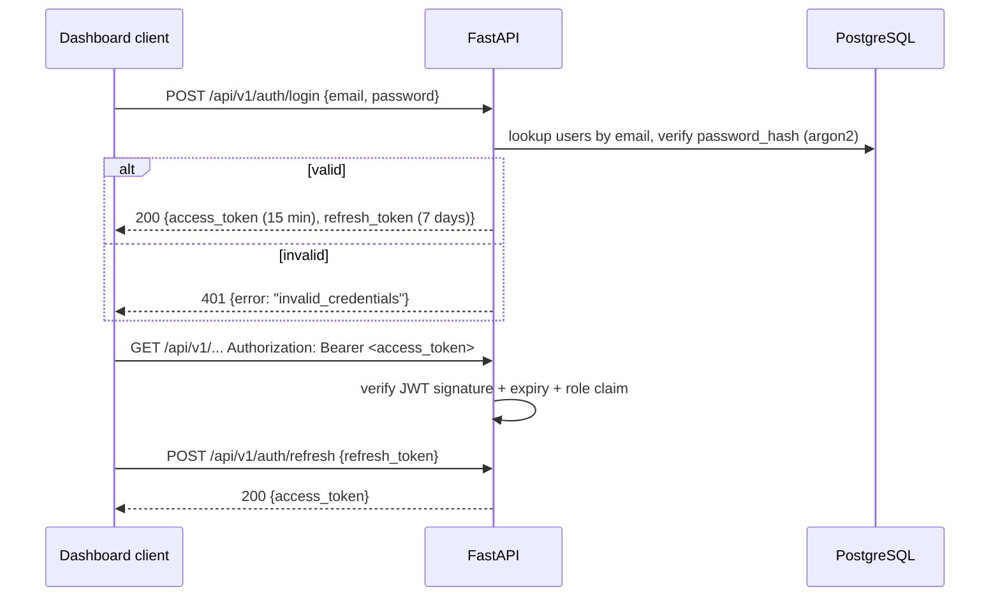

# 10 — REST API

## 1. Purpose and scope

The REST API serves the admin dashboard ([12_Dashboard.md](12_Dashboard.md)),
reporting/export ([13_Reports.md](13_Reports.md)), and future
integrations. It is **not** the primary way transactions are created —
per [`CLAUDE.md`](../CLAUDE.md#non-negotiable-philosophy), every
mutating flow must work end-to-end from WhatsApp; the API exposes a
narrower set of mutations (mostly read, plus a few owner-gated actions
like `undo`, `reconcile`, `settings` updates) rather than duplicating
every WhatsApp command as an endpoint. Duplicating full write
surface area across two interfaces would mean duplicating (and risking
divergence in) validation and business-rule logic — instead, the API's
mutating endpoints call the exact same service-layer methods the
WhatsApp handlers call.

## 2. Conventions

- Base path: `/api/v1`.
- JSON request/response bodies; `Content-Type: application/json`.
- Auth: `Authorization: Bearer <JWT>` — see §3.
- Pagination: cursor-based (`?cursor=<opaque>&limit=<n>`, default
  `limit=50`, max `200`), response includes `next_cursor: string |
  null`. Cursor pagination, not offset, for the same reason as
  `inventory_movements` history browsing
  ([03_Inventory.md §12](03_Inventory.md#12-performance-considerations)) —
  stable under concurrent inserts, and doesn't degrade on deep pages.
- Filtering: query params per resource, documented per endpoint below.
- Errors: uniform envelope (§5).
- Versioning: breaking changes get a new `/api/v2` prefix; the frontend
  and API version are deployed together so in-flight version skew is
  not a concern for v1 (single deployment, no external API consumers
  yet — see [18_FutureRoadmap.md](18_FutureRoadmap.md) for the
  public-API roadmap item where this would need to change).

## 3. Authentication



- Passwords hashed with `argon2` (via `argon2-cffi`), never bcrypt's
  72-byte truncation footgun, never plaintext, never reversible.
- JWT claims: `sub` (user id), `org_id`, `role`, `exp`. Every request
  handler resolves `org_id` from the token, never from a request
  parameter — a client cannot query another org's data by changing an
  ID in the URL even if it somehow guessed one (defense in depth on
  top of every repository query already filtering by `org_id`).
- Access tokens: 15-minute expiry, short by design since this is a
  financial system; refresh tokens: 7 days, stored hashed, revocable
  (a `revoked_refresh_tokens` set in Redis, checked on refresh) — used
  for the "log out everywhere" action in `settings`.
- WhatsApp users are **not** authenticated via JWT — see
  [08_WhatsApp.md §2](08_WhatsApp.md#2-sender-resolution-sender-resolution) —
  a `users` row can have `whatsapp_number` set, `password_hash` NULL
  (WhatsApp-only staff with no dashboard login) or vice versa
  (viewer-only accountant with no WhatsApp access), or both (a
  partner).

## 4. Endpoints

### Auth
```
POST   /api/v1/auth/login
POST   /api/v1/auth/refresh
POST   /api/v1/auth/logout
```

### Products & catalog
```
GET    /api/v1/products                 ?product_type=&brand=&category=&search=&is_active=
GET    /api/v1/products/{id}
POST   /api/v1/products                 owner
PATCH  /api/v1/products/{id}             owner
DELETE /api/v1/products/{id}             owner (soft delete)
GET    /api/v1/product-types
GET    /api/v1/brands
GET    /api/v1/units
GET    /api/v1/warehouses
```

### Purchases {#purchases}
```
GET    /api/v1/purchases                ?supplier_id=&status=&date_from=&date_to=&payment_status=
GET    /api/v1/purchases/{id}
POST   /api/v1/purchases/{id}/undo       owner
GET    /api/v1/purchases/{id}/attachment
```

### Sales {#sales}
```
GET    /api/v1/sales                    ?customer_id=&status=&date_from=&date_to=&payment_status=
GET    /api/v1/sales/{id}
POST   /api/v1/sales/{id}/undo           owner
GET    /api/v1/customers/{id}/ledger
GET    /api/v1/suppliers/{id}/ledger
```

### Inventory
```
GET    /api/v1/inventory                ?warehouse_id=&low_stock=true&negative_only=true
GET    /api/v1/inventory/{product_id}/movements   ?cursor=&limit=
POST   /api/v1/inventory/reconcile       owner (manual trigger, per 03_Inventory.md §6)
```

### Accounting
```
GET    /api/v1/reports/profit-loss      ?date_from=&date_to=       owner
GET    /api/v1/reports/balance-sheet    ?as_of=                    owner
GET    /api/v1/reports/cash-flow        ?date_from=&date_to=       owner
GET    /api/v1/ledgers/cash             ?date_from=&date_to=
GET    /api/v1/ledgers/bank             ?date_from=&date_to=
GET    /api/v1/partners/{id}/capital    owner
```

### Dashboard
```
GET    /api/v1/dashboard                see 12_Dashboard.md for full response shape
```

### Reports & export
```
POST   /api/v1/reports/export           {type, format, date_from, date_to} -> 202 + job id
GET    /api/v1/reports/export/{job_id}  poll status / download link when ready
```

### Admin
```
GET    /api/v1/audit-logs               ?entity_type=&entity_id=&date_from=&date_to=   owner
GET    /api/v1/settings                 owner
PATCH  /api/v1/settings                 owner
GET    /api/v1/users                    owner
POST   /api/v1/users                    owner
PATCH  /api/v1/users/{id}               owner
GET    /api/v1/ocr-templates            owner
PATCH  /api/v1/ocr-templates/{id}       owner
GET    /api/v1/ocr-learning-dictionary  ?supplier_id=                                   owner
```

## 5. Error envelope

```json
{
  "error": {
    "code": "duplicate_invoice",
    "message": "This invoice looks like a duplicate of one already recorded.",
    "details": {
      "existing_purchase_id": "6a1e...",
      "similarity_score": 0.92
    }
  }
}
```

- `code` is a stable machine-readable identifier (matches the
  exception class names in
  [01_Architecture.md §10](01_Architecture.md#10-error-handling-philosophy),
  snake_cased) — the dashboard frontend switches on `code`, never on
  `message` text, so copy changes never break client logic.
- HTTP status follows standard semantics: `400` validation, `401`
  unauthenticated, `403` unauthorized (wrong role/org), `404` not
  found, `409` conflict (e.g., exact duplicate, concurrent edit),
  `422` semantically invalid domain state (e.g., undo window expired),
  `500` genuinely unexpected server error (never used for expected
  domain outcomes — see
  [01_Architecture.md §10](01_Architecture.md#10-error-handling-philosophy)).

## 6. Example: purchase list response

```json
{
  "items": [
    {
      "id": "6a1e1e4e-2222-4a3a-9c33-111111111111",
      "supplier_name": "Shree Textiles",
      "invoice_no": "INV-4521",
      "invoice_date": "2026-07-24",
      "status": "confirmed",
      "grand_total": "24000.00",
      "payment_status": "partial",
      "amount_paid": "10000.00"
    }
  ],
  "next_cursor": "eyJpZCI6ICI2YTFl..."
}
```

## 7. Rate limiting & abuse protection

- Login endpoint: 5 attempts per IP per 15 minutes
  (`slowapi`/Redis-backed), then a short lockout with exponential
  backoff — protects against credential stuffing on the one
  password-based entry point into the system.
- All other endpoints: 300 requests/minute per authenticated user —
  generous, since this is an internal dashboard for ≤3 people, but
  present so a buggy frontend polling loop can't accidentally hammer
  the DB unbounded.

## 8. OpenAPI

FastAPI's automatic OpenAPI schema (`/api/v1/openapi.json`) is the
canonical machine-readable contract; this document is the
human-readable companion and must stay consistent with it — CI
includes a check that every route defined in `backend/api/` has a
corresponding entry in this doc's endpoint list (§4), failing the
build on drift (see
[17_CodingStandards.md](17_CodingStandards.md#docs-drift-check)).

## 9. Performance considerations

- List endpoints default to lean projections (list-appropriate fields
  only, e.g., purchase list omits line items) — detail is a separate
  `GET .../{id}` call, avoiding N+1-shaped over-fetching on list views
  that the dashboard's table components don't need.
- `GET /dashboard` and report endpoints read from the same Redis
  cache layer as the WhatsApp `dashboard`/`summary` commands
  ([12_Dashboard.md §4](12_Dashboard.md#4-caching-strategy-caching)) —
  one cache, two consumers, guaranteeing the dashboard web view and
  the WhatsApp `dashboard` command can never show different numbers
  at the same moment.
