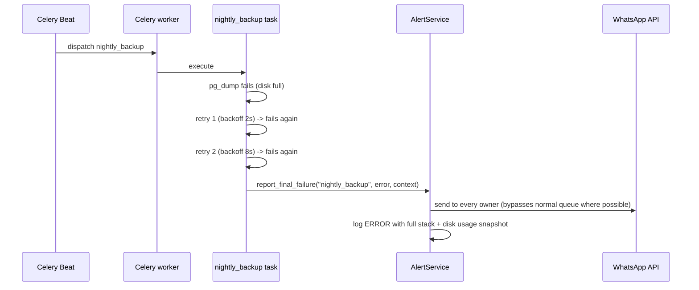

# 11 — Background Workers (Celery)

## 1. Why Celery, and task design principles

Referenced from [01_Architecture.md](01_Architecture.md) — OCR,
backups, report generation, and scheduled scans must never block a
WhatsApp webhook response. Every task follows these rules:

- **Idempotent**: safe to run twice with the same input (retries and,
  rarely, manual re-triggers must not double-apply effects).
- **Thin**: a task fetches inputs, calls one service method, handles
  Celery-specific retry/failure semantics — no business logic lives in
  `backend/workers/`.
- **Time-bounded**: every task declares a `soft_time_limit` /
  `time_limit` so a stuck task (e.g., OCR hanging on a corrupt image)
  is killed rather than occupying a worker slot indefinitely.

## 2. Task catalogue

| Task | Trigger | Queue | Timeout | Retry policy |
|---|---|---|---|---|
| `ocr_process_purchase_sheet` | Webhook enqueues on photo/PDF upload | `ocr` | soft 60s / hard 90s | 3 retries, exponential backoff (2s, 8s, 32s) on infra errors only (§4) |
| `send_whatsapp_message` | Any service needing to reply/notify async | `whatsapp` | soft 15s / hard 30s | 5 retries, backoff (1s, 3s, 9s, 27s, 81s) — matches WhatsApp API's own transient-5xx behavior |
| `low_stock_scan` | Celery Beat, nightly 06:00 org-local time + after every `sale` movement (sync check, not this task) | `scheduled` | soft 120s | 2 retries |
| `nightly_backup` | Celery Beat, nightly 02:00 org-local | `backup` | soft 600s | 2 retries, alerts owner on final failure (§5) |
| `inventory_reconciliation` | Celery Beat, nightly 02:30 org-local | `scheduled` | soft 300s | 2 retries, never auto-corrects (§ [03_Inventory.md §6](03_Inventory.md#6-mismatch-detection)) |
| `ledger_reconciliation` | Celery Beat, nightly 02:45 org-local | `scheduled` | soft 300s | 2 retries |
| `report_generation` | `export` command / API `POST /reports/export` | `reports` | soft 180s | 2 retries |
| `session_expiry_sweep` | Celery Beat, every 5 min | `scheduled` | soft 30s | 1 retry (cheap, next run will catch it anyway) |
| `withdrawal_approval_timeout_sweep` | Celery Beat, hourly | `scheduled` | soft 30s | 1 retry |
| `suspicious_activity_scan` | Celery Beat, hourly (see [14_Security.md](14_Security.md#suspicious-transaction-detection)) | `scheduled` | soft 60s | 2 retries |

Separate queues (`ocr`, `whatsapp`, `scheduled`, `backup`, `reports`)
so a burst of OCR jobs can never starve the latency-sensitive
`send_whatsapp_message` queue, and worker container concurrency is
tuned per queue (`whatsapp` workers: high concurrency, low per-task
cost; `ocr` workers: low concurrency, high per-task CPU cost) — see
[16_Deployment.md](16_Deployment.md#celery-worker-sizing).

## 3. Celery Beat schedule

```python
# backend/workers/schedule.py
CELERYBEAT_SCHEDULE = {
    "low-stock-scan": {"task": "low_stock_scan", "schedule": crontab(hour=6, minute=0)},
    "nightly-backup": {"task": "nightly_backup", "schedule": crontab(hour=2, minute=0)},
    "inventory-reconciliation": {"task": "inventory_reconciliation", "schedule": crontab(hour=2, minute=30)},
    "ledger-reconciliation": {"task": "ledger_reconciliation", "schedule": crontab(hour=2, minute=45)},
    "session-expiry-sweep": {"task": "session_expiry_sweep", "schedule": crontab(minute="*/5")},
    "withdrawal-approval-timeout-sweep": {"task": "withdrawal_approval_timeout_sweep", "schedule": crontab(minute=0)},
    "suspicious-activity-scan": {"task": "suspicious_activity_scan", "schedule": crontab(minute=0)},
}
```

Crontab times are evaluated in the org's configured timezone (via a
`crontab(..., timezone=org.timezone)`-aware Celery Beat scheduler
customization, since `organizations.timezone` is per-org data, not a
process-wide setting — relevant for the future multi-org case per
[18_FutureRoadmap.md](18_FutureRoadmap.md), harmless overhead for the
single-org case today).

## 4. Retry policy {#retry-policy}

- **Retried**: infrastructure/transient errors only — DB connection
  errors, WhatsApp API 5xx/timeout, OCR engine crash on a specific
  image (retried once in case it was a transient resource issue, e.g.
  worker memory pressure, before falling back to manual entry).
- **Never retried**: domain/validation errors (per
  [01_Architecture.md §10](01_Architecture.md#10-error-handling-philosophy)) —
  retrying a duplicate-invoice rejection or a malformed command
  produces the identical rejection every time; retrying wastes worker
  capacity and delays the user's error message for no benefit.
- Backoff is exponential with jitter (`celery`'s built-in
  `retry_backoff=True, retry_jitter=True`) to avoid thundering-herd
  retry storms if an external dependency (WhatsApp API) is degraded.
- After final retry exhaustion, the task's failure handler:
  1. Logs full context at `ERROR`.
  2. For user-facing tasks (`ocr_process_purchase_sheet`,
     `send_whatsapp_message`), sends the best-effort fallback message
     described in [01_Architecture.md §10](01_Architecture.md#10-error-handling-philosophy)
     ("Something went wrong, we're on it") via a *different* delivery
     path where possible (e.g., a lower-fidelity direct API call
     bypassing the queue) so the user isn't left in total silence.
  3. For scheduled/system tasks (backup, reconciliation), alerts the
     `owner` role directly — a silently-failing nightly backup is
     exactly the kind of failure that must never go unnoticed.

## 5. Nightly backup {#nightly-backup}

- `pg_dump` (custom format, compressed) of the full database, plus a
  tarball of the `attachments` object storage volume (scanned invoice
  images — the OCR ground truth and legal record, not reconstructable
  from the DB alone).
- Written to a location **physically/logically separate** from the
  primary server (see [16_Deployment.md](16_Deployment.md#backup-restore)
  for the exact target — off-host object storage or a second volume,
  never only a local directory on the same disk as the database it's
  backing up).
- Retention: `settings.backup_retention_days` (default 90), older
  backups pruned by the same task after a successful new backup
  completes (never prune before confirming the new backup is valid —
  verified via a checksum + a lightweight restore-to-scratch-schema
  smoke test, not just "the `pg_dump` process exited 0").
- On success: logged, and a low-key confirmation available via the
  `backup` command's history, not pushed to WhatsApp every night
  (that would be noise); on failure: escalated per §4.3 immediately,
  every night, until resolved — a failing backup is never allowed to
  become a low-priority recurring notification the owner tunes out.

## 6. Reconciliation jobs {#reconciliation}

Both `inventory_reconciliation`
([03_Inventory.md §6](03_Inventory.md#6-mismatch-detection)) and
`ledger_reconciliation`
([06_Accounting.md §12](06_Accounting.md#12-reconciliation--integrity-checks-nightly))
share a common pattern, implemented via a shared
`ReconciliationRunner` base:

1. Replay the append-only source-of-truth table (`inventory_movements`
   / `cash_ledger` / `bank_ledger` / `journal_lines`) to compute
   expected current state.
2. Compare against the live cached/snapshot state.
3. On match: record a successful `reconciliation_runs` row (auditable
   proof the check happened, not just silence implying success).
4. On mismatch: **never auto-correct** — alert `owner` role with the
   specific discrepancy, log full detail, surface on the dashboard
   until acknowledged.

This "detect, never silently fix" rule is applied uniformly across
every reconciliation job in the system, not just inventory — a single
shared principle rather than a per-domain judgment call, so a new
reconciliation job added later inherits the correct default behavior
automatically by extending `ReconciliationRunner`.

## 7. `low_stock_scan`

Nightly full scan (catches anything the synchronous post-sale check in
[03_Inventory.md §7](03_Inventory.md#7-low-stock-alerts) might have
missed — e.g., a `reorder_level` was only just configured after stock
was already low) plus the synchronous check after every `sale`
movement (not a Celery task — cheap enough to run inline in the sale
transaction's aftermath). The nightly scan additionally reports
negative-stock items regardless of `reorder_level`.

## 8. `report_generation`

Dispatched from the `export` WhatsApp command and the API's
`POST /reports/export`. See [13_Reports.md](13_Reports.md) for output
formats. The task writes progress state (`queued` → `generating` →
`ready`/`failed`) to a `report_jobs` table so both the WhatsApp
follow-up message and API polling (`GET
/api/v1/reports/export/{job_id}`) read the same status.

## 9. `suspicious_activity_scan`

Runs the detection rules cataloged in
[14_Security.md #suspicious-transaction-detection](14_Security.md#suspicious-transaction-detection)
hourly (in addition to any checks that run synchronously at
transaction time) to catch patterns only visible in aggregate (e.g.,
"5 below-cost sales confirmed by the same user in one hour").

## 10. Sequence diagram: task failure and alerting



## 11. Performance & scalability

- Worker containers scale horizontally and independently per queue
  (stateless workers, per
  [01_Architecture.md §11](01_Architecture.md#11-performance--scalability-considerations)) —
  at current two-user scale, one worker process covering all queues
  with modest concurrency is sufficient; queue separation exists so
  splitting into dedicated worker containers per queue later
  (e.g., if OCR volume grows) is a deployment config change, not a
  code change.
- `ocr` queue concurrency is deliberately capped low (matches CPU core
  count, since PaddleOCR/Tesseract inference is CPU-bound per
  [07_OCR.md §13](07_OCR.md#13-performance)) — oversubscribing it would
  slow down every concurrent OCR job rather than genuinely
  parallelizing, given the CPU-only deployment target.
- Redis (broker + result backend) sizing is trivial at this scale; if
  task volume grows substantially, the result backend can be disabled
  for fire-and-forget tasks (`send_whatsapp_message`,
  `low_stock_scan`) to reduce Redis memory pressure — not needed now,
  documented as a lever.
