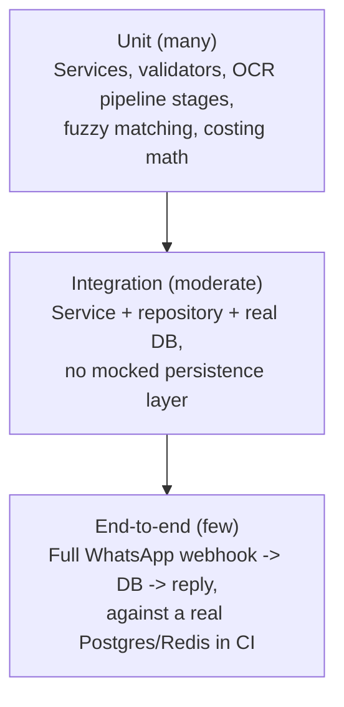

# 15 — Testing Strategy

## 1. Testing pyramid

- **Unit tests**: pure logic — weighted average cost math (§ below),
  freight allocation, fuzzy-duplicate scoring, OCR confidence
  formulas, command grammar parsing. No DB, no network — fast, run on
  every save in local dev.
- **Integration tests**: service-layer methods against a real
  Postgres test database (via `testcontainers` or a dedicated CI
  Postgres service) — deliberately **not** mocking the DB, because the
  behaviors that matter most here (row locking, constraint
  enforcement, transaction rollback on error, partial-unique-index
  soft-delete semantics) are exactly the things a mocked session
  would hide. This is a direct application of "integration tests must
  hit a real database, not mocks" as a house rule for this kind of
  ledger-correctness-critical system.
- **End-to-end tests**: simulate a full WhatsApp webhook payload
  through signature verification, dedup, command routing, service
  execution, and reply generation — a handful of these cover the
  critical user journeys (purchase-via-OCR-to-confirmation, sale with
  below-cost warning, capital withdrawal with dual approval) rather
  than every command, since E2E tests are the slowest and most
  brittle layer.

## 2. Coverage target

95%+ on `backend/services/` and `backend/ocr/` (per
[`CLAUDE.md`](../CLAUDE.md#coding-standards)), measured via
`pytest-cov`, enforced in CI (`--cov-fail-under=95` on those two
packages specifically; `backend/api/` and `backend/repositories/` are
covered but not held to the same threshold, since routers are thin by
design and integration tests exercise repositories indirectly through
services). Coverage is a floor, not a target to game — a PR adding
untested edge-case handling to hit a percentage without exercising the
actual behavior is caught in review (see
[17_CodingStandards.md](17_CodingStandards.md#pr-checklist)).

## 3. Domain-specific test suites

### 3.1 Weighted average cost math

Table-driven unit tests directly encoding the worked example from
[03_Inventory.md §2](03_Inventory.md#2-weighted-average-cost--the-algorithm)
plus edge cases: zero opening stock, single-unit purchases, purchase
return exceeding remaining batch contribution (approximation path),
sale return at historical vs. current cost, rounding behavior at the
`NUMERIC(12,4)` boundary (e.g., a cost that would round differently at
2 vs. 4 decimal places, asserting the system consistently uses 4).

### 3.2 Freight allocation

Property-based test (via `hypothesis`): for randomly generated line
sets and freight amounts, `sum(line.freight_allocated) ==
header.freight` exactly, for all three allocation methods — the
remainder-to-last-line rule from
[04_Purchases.md §4](04_Purchases.md#4-freight-and-other-charge-allocation-freight-allocation)
is exercised across many random splits, not just one hand-picked
example.

### 3.3 Duplicate detection

Fixture pairs of purchases/sales spanning: exact duplicate (blocked),
2-of-3 fuzzy match (warned), 1-of-3 only (not flagged — must NOT
false-positive), invoice number OCR-typo variants
(`INV-4521`/`INV45 21`/`1NV-4521`), and a genuinely separate purchase
that happens to share one coincidental field (same total, different
supplier — must not be flagged as it involves the wrong supplier
scope entirely).

### 3.4 Accounting parity tests {#accounting-parity-tests}

For a generated sequence of transactions (purchases, sales, returns,
expenses, capital events), assert that:
- P&L computed via the simplified-ledger method
  ([06_Accounting.md §5](06_Accounting.md#5-profit--loss)) equals P&L
  computed via `journal_lines` account rollup, exactly, every time.
- Balance sheet equation (`Assets = Liabilities + Equity`) holds after
  every single transaction in the sequence, not just at the end — this
  catches a bug that transiently unbalances the books even if it
  happens to net out later.

### 3.5 Audit coverage test {#audit-coverage-test}

A static/reflection-based test that enumerates every public method on
every class in `backend/services/` matching mutation-verb naming
conventions (`create_`, `confirm_`, `update_`, `delete_`, `undo_`,
`record_`) and asserts (via a marker/decorator convention — e.g.
`@audited` — that such methods must carry) that each one is wired to
call `AuditService.record`. New service methods that skip this
convention fail CI immediately rather than being caught later in a
manual review, per [14_Security.md §2](14_Security.md#2-audit-log-audit-log-detail).

### 3.6 OCR accuracy benchmarks {#ocr-accuracy-benchmarks}

A fixture corpus (`backend/tests/fixtures/ocr/`) built from:
- Rendered images derived from the reference sample sheets
  (`wagdia textile company.xlsx`, `Textile_Inventory_Template.xlsx`),
  hand-labeled with ground-truth field values per cell.
- Deliberately degraded variants of the same sheets: rotated (±5°,
  90°), low-contrast/shadowed, partially cropped, and a synthetic
  two-column layout — covering the edge cases enumerated in
  [07_OCR.md §12](07_OCR.md#12-edge-cases-exhaustive).

Each fixture asserts **field-level accuracy** (correct value extracted
per cell, post fuzzy-match/learning-dictionary resolution) against the
labeled ground truth. CI fails if accuracy on any fixture regresses
versus the last recorded baseline (stored alongside the fixture) — an
OCR pipeline change (model upgrade, threshold tweak) that improves
some fixtures while regressing others must be a deliberate, reviewed
tradeoff, not an accidental regression that slips through because
"the tests still pass."

### 3.7 Excel golden-file tests {#excel-golden-file-tests}

For the purchase-sheet export
([13_Reports.md §5](13_Reports.md#5-excel-export-format-compatibility-excel-export-format-compatibility)),
a generated workbook for a fixed fixture dataset is compared
cell-by-cell (values, number formats, column widths, bold/border
styling on the totals row) against a committed "golden" reference
workbook. Any diff fails CI with a human-readable summary of exactly
which cells/properties changed — format drift is caught at PR time,
not discovered by a partner opening a mis-formatted export months
later.

### 3.8 WhatsApp command grammar tests

Every command in [08_WhatsApp.md](08_WhatsApp.md) has parser unit
tests covering: the documented example, common real-world variations
(extra whitespace, different date separators the parser should
normalize, mixed case), and every documented error case (malformed
syntax, missing required field) — the test suite is effectively a
runnable version of the command reference table, generated from the
same command-registry data source referenced in
[17_CodingStandards.md #command-registry-pattern](17_CodingStandards.md#command-registry-pattern)
so the tests and the documented syntax cannot silently diverge.

### 3.9 AI intent classification tests

For each intent in the [09_AI.md §3](09_AI.md#3-supported-intent-catalogue-v1)
catalogue, a set of paraphrased example questions (including the exact
examples from `CLAUDE.md`'s AI Queries section) must classify to the
correct intent with correct slot extraction — run against the actual
classifier (not mocked), since classification accuracy is the
property being tested; flaky/borderline cases are tracked and
tightened over time via the `ai_unmatched_queries` feedback loop from
[09_AI.md §7](09_AI.md#7-failure-scenarios).

## 4. Test data & fixtures

- `backend/tests/factories/` (via `factory_boy` or equivalent):
  typed factories for every model, producing valid-by-default rows
  (respecting all `CHECK` constraints) with sensible overrides per
  test — avoids each test hand-constructing verbose valid rows.
- Every test runs inside a transaction that's rolled back at test end
  (or a fresh schema per test module for tests that need to assert on
  triggers/constraints that only fire on commit) — tests never leak
  state into each other regardless of execution order, and can safely
  run in parallel (`pytest-xdist`) for CI speed.

## 5. CI pipeline {#ci-pipeline}

Every stage must pass; nothing merges to `main` on a red pipeline,
including the docs-drift and golden-file checks — these are treated as
first-class correctness gates, not optional linting, because a drifted
doc or a silently-changed export format are exactly the kind of
regressions that are invisible until a real user hits them.

## 6. Manual/exploratory testing before releases

- A short pre-release checklist walks through the primary WhatsApp
  journeys against a staging environment loaded with realistic
  (anonymized) data: OCR a real sample sheet end-to-end, confirm a
  purchase, record a credit sale, trigger a below-cost warning, run
  `dashboard`/`summary`, export a purchase report and diff it visually
  against a partner-provided reference sheet.
- OCR template tuning specifically happens against **real supplier
  sheets** in staging before rollout to a new supplier (per
  [01_Architecture.md §9](01_Architecture.md#9-configuration--environments)) —
  automated fixture tests catch regressions on known formats, but a
  brand-new supplier's sheet layout is validated by a human before its
  `ocr_templates` row is marked active for production use.

## 7. Load/performance testing

Not a priority investment for v1 given the explicit two-user scale
target ([01_Architecture.md §11](01_Architecture.md#11-performance--scalability-considerations)) —
a lightweight `locust` script exercising the WhatsApp webhook and
dashboard endpoints exists to catch gross regressions (e.g., an
accidental N+1 query introduced in a PR) but is not tuned for
realistic high-concurrency load, since building that out now would be
testing infrastructure for a scale this deployment isn't targeting.
