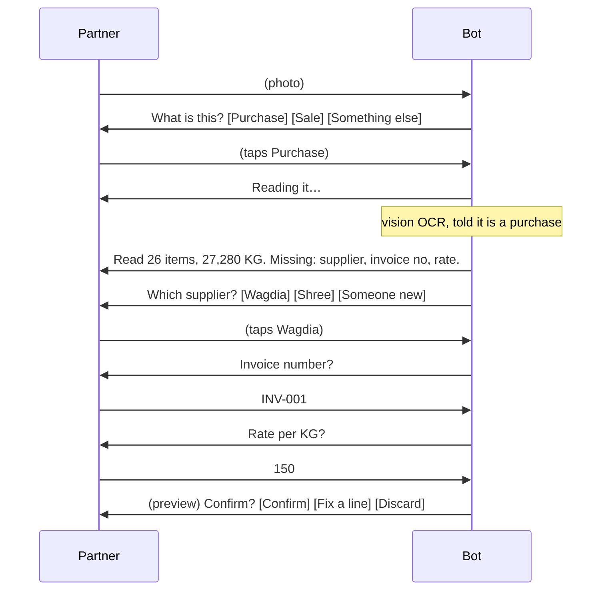

# 20 — Conversational Intake

## 1. The idea {#idea}

> **A partial command is a question, not an error.**

Today an incomplete or mistyped command produces a usage string. That
has failed in practice: eight consecutive `paid` attempts were rejected
with the same line, one of them differing from correct only by writing
`ref 001` instead of `against 001`. A first purchase looked like a dead
end because the command that resolved it was never named.

The replacement is a single principle applied everywhere: when the
system knows a field is missing, it **asks for that field** — one at a
time, offering choices whenever choices exist, and only ever requiring
typing for a value it could not have known.

This extends [19_InteractiveMessages.md](19_InteractiveMessages.md),
which covers the button and list mechanics and their platform limits.
That doc's §6 said "no typing for decisions, still typing for data."
This one narrows the second half: **still typing for data the system
has no way to offer**, and never as a template to be memorised.

## 2. The intake flow {#flow}

The target: photograph anything — printed sheet, handwritten register
page, a screenshot forwarded from another chat — and answer questions.

Three deliberate orderings:

**Intent is asked before OCR runs.** A vision call costs roughly ₹4–5
per sheet, and a photo sent by mistake shouldn't spend it. Knowing the
intent also improves extraction — a sales sheet and a purchase sheet
have different columns — so the prompt can be told what it is reading.

**Gap analysis happens before any question.** The bot states what it
found and what it needs, so the partner knows how many questions are
coming rather than being drip-fed with no visible end.

**Confirmation stays last and unchanged.** The existing preview and
`CONFIRM` step (docs/04_Purchases.md §3) is where the intelligent
checks fire; nothing about slot filling bypasses it.

## 3. Gap analysis is already possible {#gaps}

No new detection logic is needed:

- `backend/ocr/vision_engine.py` already returns `supplier_name`,
  `invoice_no` and `invoice_date` as **empty strings** when they are
  not printed on the sheet.
- `ocr_templates.required_manual_fields` is already JSONB config on the
  template, defaulting to
  `["supplier","brand","invoice_no","invoice_date","purchase_rate","freight","other_charges"]`.

So the slot list is **the template's config minus what OCR found** —
config over code ([`CLAUDE.md`](../CLAUDE.md#non-negotiable-philosophy)
rule 6), and a second product type brings its own required fields
without touching this logic.

A field is "found" only if it is non-empty *and* above the confidence
floor. On a handwritten sheet a low-confidence supplier name is
**offered as a suggestion to confirm**, not silently accepted (§6).

## 4. Slot types {#slots}

Each slot declares how it is asked. The rule: **if the system can
enumerate the answers, it must offer them.**

| Slot | How it's asked | Fallback |
|---|---|---|
| `supplier` / `customer` | List of recent parties + `Someone new` | Type the name |
| `invoice_date` | Buttons: `Today` · `Yesterday` · `Other date` | Type DD-MM-YYYY |
| `brand` | List of brands + `No brand` | Type the name |
| `payment` | Buttons: `Cash` · `Bank` · `Credit` | — |
| `freight`, `other_charges` | Buttons: `None` · `Enter amount` | Type a number |
| `invoice_no` | Typed — unguessable | — |
| `purchase_rate` | Typed, with the unit named ("Rate per KG?") | — |

Optional slots default rather than block: `freight` and
`other_charges` offer `None`, which is the common case, so the
questions cost one tap each rather than a typed zero.

Amounts accept whatever the system itself prints — `40,00,000`, `₹150`
— via `backend/api/amounts.py`.

## 5. One question at a time {#state}

A new session state, `AWAITING_SLOT`, holds the draft plus an ordered
queue of unfilled slots. Each inbound reply fills the head of the queue
and advances; when the queue empties, the normal preview renders.

Escape hatches, because a linear wizard with no exits is a trap:

| Input | Effect |
|---|---|
| `back` | Re-asks the previous slot, clearing its value |
| `skip` | Only on optional slots; applies the default |
| `cancel` | Abandons the draft, says so explicitly |
| a recognised command | **Abandons the wizard and runs the command.** Someone who types `stock` mid-wizard wants stock, not to name it as their supplier |
| anything else | Treated as the answer to the current slot |

That fourth row is the one that prevents the wizard becoming a mode the
user is stuck inside.

## 6. Handwritten sheets {#handwritten}

Vision handles handwriting far better than the local PaddleOCR/Tesseract
path, which is already the fallback rather than the primary
(docs/07_OCR.md; the vision engine landed later than that doc). But
handwriting lowers confidence, and the failure mode that matters is a
misread digit in a quantity or a rate — silent, and wrong in money.

Rules:

- Any numeric cell below the confidence floor is **read back for
  confirmation** before the preview, not accepted quietly.
- The existing qty × kg cross-check
  (`OcrService._costing_quantity`) already flags rows whose arithmetic
  disagrees and **keeps the sheet's stated figure rather than guessing**.
  That behaviour stays exactly as-is; handwriting makes it fire more
  often, which is correct.
- If more than `ocr_manual_field_ratio_threshold` of cells are
  low-confidence, the reply says the photo is hard to read and offers
  `Retake photo` before spending the partner's time on slot filling.

## 7. Applying the same principle to every command {#commands}

The wizard is not only for photos. **Any command invoked with missing
arguments should ask instead of printing usage.**

| Typed | Today | With this |
|---|---|---|
| `paid` | Usage string | "Which supplier?" → list |
| `paid wagdia` | Usage string | "How much?" → typed → "Cash or bank?" → buttons |
| `sale` | Usage string | "Which customer?" → list → … |
| `expense` | Usage string | "What kind?" → list of used categories |
| `export` | Usage string | "Which report?" → buttons → "Which period?" → list |

A **complete** command still executes in one shot, unchanged. This
matters: the wizard costs one round trip per slot, so for someone who
knows the syntax, typing it fully is faster. Both paths stay first
class — §10 tests every flow both ways.

The main menu (`help`, or any unrecognised input) becomes a list menu
grouped by intent: Record · Reports · Manage.

## 8. What this costs {#costs}

Stated plainly, because these are real trade-offs and not all of them
are favourable:

- **Round trips.** A five-slot purchase is five exchanges. Faster for
  a newcomer, slower for a fluent user — hence keeping one-shot
  commands.
- **Session lifetime.** A wizard lives in the 30-minute session TTL
  (`settings.session_timeout_minutes`). An abandoned wizard expires
  like any draft, and the expiry message says what was lost.
- **Vision cost is unchanged** — one call per photo, now spent only
  after the partner confirms what the photo is.
- **Buttons need Cloud API.** On the whatsapp-web.js bridge every
  question degrades to text with the options listed
  ([19 §3](19_InteractiveMessages.md#transport)). The flow still
  completes; it just reads as a numbered list.
- **More states to test.** A slot machine has more paths than a fixed
  template. §10 is not optional.

## 9. Failure scenarios {#failures}

| Scenario | Behaviour |
|---|---|
| Photo isn't a sheet at all (a selfie, a receipt) | Intent buttons come first, so nothing is OCR'd until the partner says what it is; `Something else` ends the flow politely |
| Partner answers a slot with an obviously wrong type ("cash" when asked for a rate) | The slot validates and re-asks naming what it expected — never accepts and never loops silently |
| Partner sends a second photo mid-wizard | Current draft is offered for discard first; two drafts must never be live at once |
| Supplier list exceeds 10 rows ([19 §2](19_InteractiveMessages.md#limits)) | Most recent 9 plus `Someone new`; typing a name still works and matches fuzzily |
| Vision returns a supplier that doesn't exist in the catalogue | Treated as a *suggestion*: "Supplier looks like 'Wagdia' — correct?" rather than auto-creating a party |
| Session expires mid-wizard | The next message says the draft expired and offers to start again; nothing partial is ever saved |
| Duplicate photo of an already-confirmed purchase | Existing check fires before intent is asked (docs/04_Purchases.md §6) |

## 10. Implementation shape {#implementation}

1. **`SlotSpec`** — name, prompt copy, how to offer choices, validator,
   optional default. Slot sets are built from
   `ocr_templates.required_manual_fields` for the OCR path and declared
   per command for the typed path.
2. **`IntakeService`** — given a draft and a template, returns the
   ordered queue of unfilled slots. Pure; no I/O beyond the lookups
   that build choice lists.
3. **`AWAITING_SLOT` session state** holding `{draft, queue, filled}`.
4. **Dispatcher change** — an unrecognised message during
   `AWAITING_SLOT` is a slot answer; a *recognised command* still wins
   (§5).
5. **Reuse, not replacement.** A filled slot queue produces exactly the
   `Draft` the `details` command produces today, and hands to the same
   preview and `confirm`. `details` remains as the one-shot form for
   anyone who prefers it.

Nothing here changes a service. The slot machine sits in the API layer
where the other conversational state already lives.

## 11. Phasing {#phasing}

**Phase 1 — the OCR intake path. ✅ Built.** Intent buttons, gap
analysis, slot filling for supplier/invoice/date/rate. This is the flow
that has actually failed in use, twice.

Where it lives: `backend/api/commands/intake_commands.py` (the intent
gate and the slot machine), `read_stored_sheet()` in
`ocr_commands.py` (OCR runs *after* intent is answered, so a mis-sent
photo never spends a vision call), and the `AWAITING_INTENT` /
`AWAITING_SLOT` routing in `whatsapp_dispatcher.py`. `details ...`
survives as a one-shot that fills every remaining slot in one message,
and is tested for equivalence with answering them one at a time.

**Phase 2 — command wizards. ✅ Built.** `paid`, `received`, `sale`,
`expense`, `income` and `export` ask for missing arguments instead of
printing usage, and parties are offered as a list of who you actually
trade with.

Where it lives: `backend/api/commands/wizards.py`, dispatched from
`WhatsAppDispatcher._run`. The design point worth keeping: a finished
wizard **assembles the canonical one-shot argument string and calls the
command's own handler**, so the two forms cannot drift — the wizard
*becomes* the typed command. `prefill` is deliberately conservative;
anything it cannot place with certainty is asked for, because a wrong
guess here is a wrong payment.

**Phase 3 — extended to every remaining command** (2026-07-29):
`capital` (partner list → amount → cash/bank → contribution/withdrawal
buttons), `withdraw`, `edit` (record kind → which one → **the fields
that kind actually has** → new value) and `delete`.

`delete` is the one that needed care. A wizard makes a destructive
command *easier* to reach — three taps from nothing to gone — so it
always confirms, the confirmation **names what it is about to delete**
("Delete product TRP?"), and `delete product TRP` typed in full still
stops to ask. Knowing the syntax should not skip the safety step.

This is also why a choice builder now receives the answers so far: the
field list for `edit` is a function of the record kind just chosen.

**Phase 3 — main menu + handwriting confirmation pass.**

Phase 1 depends on [19](19_InteractiveMessages.md) Phase 1 being done
first: without `send_interactive` and inbound button parsing, every
question here is a text prompt, which works but is the lesser version.

## 12. Testing {#testing}

- Every flow is tested **twice** — once by tapping, once by typing the
  same answers — asserting an identical resulting `Draft`. This is the
  rule from [19 §10](19_InteractiveMessages.md#testing) and it is what
  stops the two input paths drifting apart.
- A **one-shot vs. wizard equivalence** test: `paid Wagdia 40000 cash`
  in one message must produce the same ledger and journal rows as
  answering three slots. If those ever diverge, one of them is wrong.
- Slot validators are tested with the wrong *type* of answer, not just
  malformed ones — "cash" where a rate belongs is the realistic mistake.
- An escape-hatch test per exit: `back`, `cancel`, and a recognised
  command mid-wizard.
- A test that a sheet with **no** missing fields skips straight to the
  preview and asks nothing. The wizard must not invent questions.
